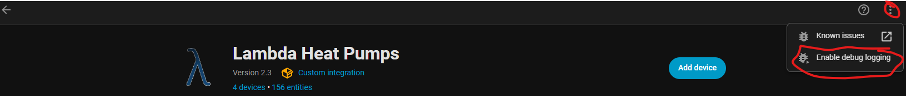
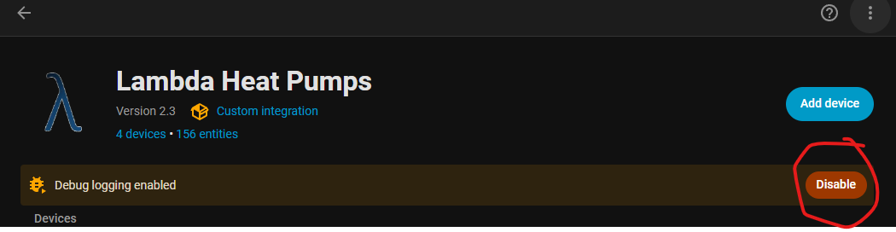

# Debug Logs erzeugen

*Zuletzt geändert am 21.03.2026*

Um Fehler zu analysieren oder detaillierte Abläufe der Integration zu prüfen, können Sie die Debug-Protokollierung für Lambda Heat Pumps einschalten.

## Debug-Logging aktivieren

  
  
<strong>Schritt 1:</strong> Öffnen Sie <strong>Einstellungen → Geräte & Dienste → Integrationen</strong>, wählen Sie die Integration <strong>Lambda Heat Pumps</strong> und klicken Sie oben rechts auf die <strong>drei Punkte (⋮)</strong>. Im Menü wählen Sie <strong>„Enable debug logging“</strong>.

## Debug-Logging ist aktiv

  
  
<strong>Schritt 2:</strong> Wenn Debug-Logging aktiv ist, erscheint ein gelber Hinweisbanner <strong>„Debug logging enabled“</strong>. Über die Schaltfläche <strong>„Disable“</strong> können Sie die Debug-Ausgabe wieder abschalten. 
  

  Der Browser startet dann automatisch einen Download der erzeugten Logs</strong>.

