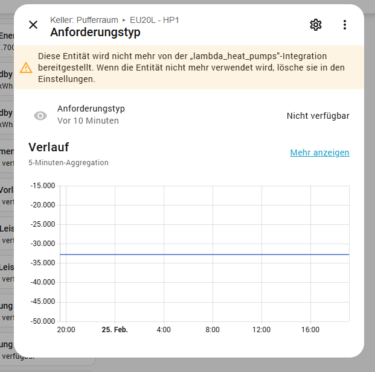
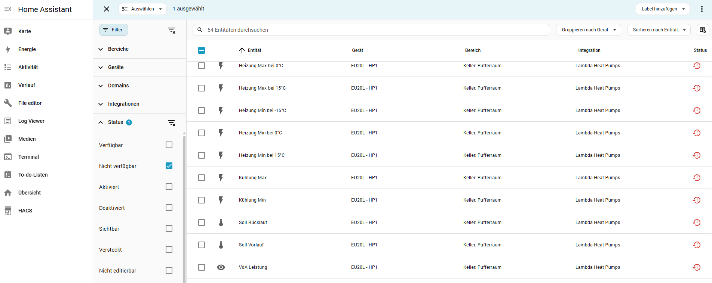
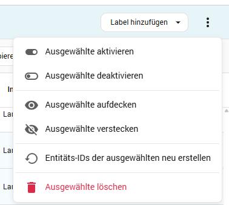

# Entitäten löschen

*Zuletzt geändert am 21.03.2026*

Entitäten, die von der Lambda-Integration nicht mehr bereitgestellt werden (z. B. nach einem Update oder nach Änderungen an der Firmware), können in Home Assistant gelöscht werden. Es gibt zwei Wege.

## Weg 1: Über die Entitätsseite

  

    
  

  

    <ol>
      <li>Öffnen Sie die Detailseite der Entität (z. B. aus der Übersicht oder über „Geräte & Dienste“).</li>
      <li>Klicken Sie oben rechts auf das <strong>Zahnrad</strong> (Einstellungen).</li>
      <li>Wählen Sie im Menü die Option <strong>Löschen</strong> und bestätigen Sie.</li>
    </ol>
    
So können Sie eine einzelne Entität gezielt entfernen, z. B. wenn sie als „nicht mehr bereitgestellt“ angezeigt wird.

  

## Weg 2: Über Geräte & Dienste (mehrere Entitäten)

  

    
  

  

    <ol>
      <li>Gehen Sie zu <strong>Einstellungen</strong> → <strong>Geräte & Dienste</strong>.</li>
      <li>Wechseln Sie zum Tab <strong>Entitäten</strong>.</li>
      <li>Setzen Sie den Filter nach <strong>Status</strong> (z. B. „Nicht verfügbar“), um betroffene Entitäten zu finden.</li>
      <li>Optional: Nach <strong>Integration</strong> „Lambda Heat Pumps“ filtern.</li>
      <li>Markieren Sie die Entitäten, die gelöscht werden sollen (Checkboxen).</li>
    </ol>
  

  

    
  

  

    <ol start="6">
      <li>Klicken Sie oben auf die <strong>drei Punkte</strong> (Menü).</li>
      <li>Wählen Sie <strong>Ausgewählte löschen</strong>.</li>
      <li>Bestätigen Sie die Löschung.</li>
    </ol>
    
So können Sie mehrere nicht mehr benötigte Entitäten in einem Schritt entfernen.

  

## Hinweis

Nach dem Löschen von Entitäten sollten Sie prüfen, ob Automatisierungen, Dashboards oder Szenen noch auf diese Entitäten verweisen, und diese Anpassungen ggf. aktualisieren oder die Referenzen entfernen.
