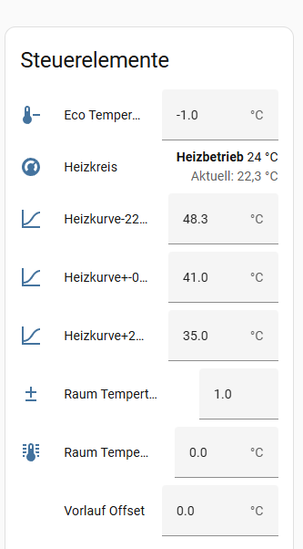

# Heizkurve

Die Lambda Wärmepumpen Integration berechnet die Vorlauftemeratur des heizkreises.
Die Heizkurve bestimmt die Vorlauftemperatur basierend auf der Außentemperatur und ermöglicht eine energieeffiziente und komfortable Heizungssteuerung. Der Sensor "heating_curve_flow_line_temperature_calc" / "Heizkurve Vorlauf ber." wird dazu zur Verfügung gestellt.

## Übersicht

Damit die Berechnug der Vorlauftempertur für den Heizkreis erfogen kann, müssen die Einstellungen zur Heizkurve von der Lambda in die Home Assistsnt Integration per Hand übertragen werden. Leider stellt die Lambda Wärmepumpe keine Möglichkeit zur Verfügung, diese Werte automatisch auszulesen.
Die drei Stützpunkte, die Eco Tempertur Reduktion und das Vorlauf Offset müssen immer eingetrage werden, damit die Vorlauftemperteur berechnet werden kann.

Wenn ein Raumtermometer in dem Heizkreis aktiviert ist, so müssen auch die Felder "Raum Tempertur Faktor", "Raum Tempertur Offset" konfiguriert werden. Diese Felder werden nur sichtbart in der Integration, wenn ein Raumtermometer in dem Heizkreis konfiguriert ist

Weitere Informationen: [Raumthermostat](raumthermostat.md)

