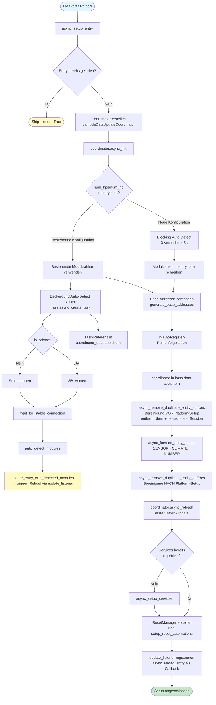
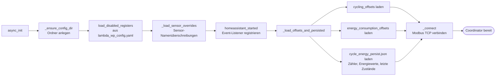
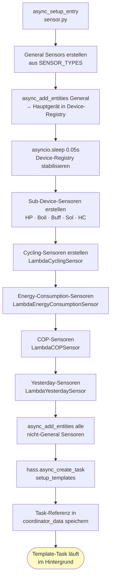
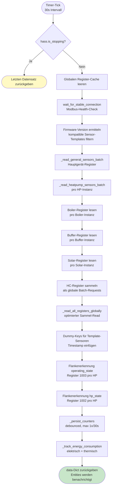
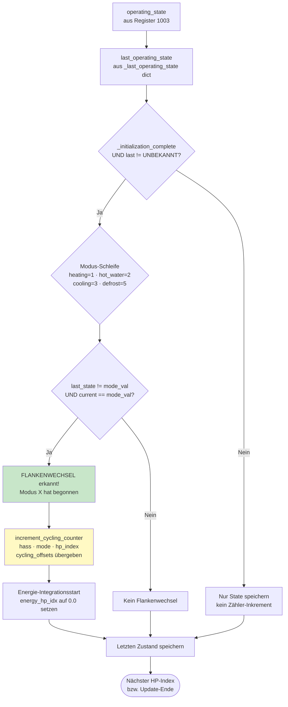
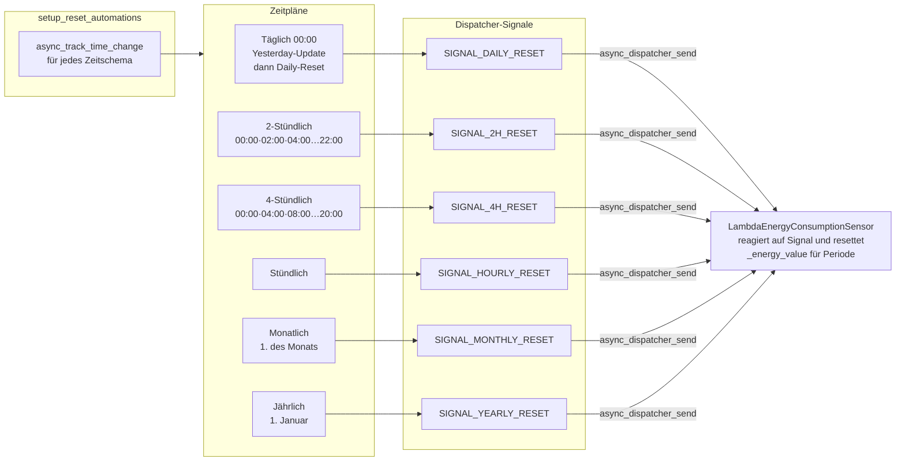
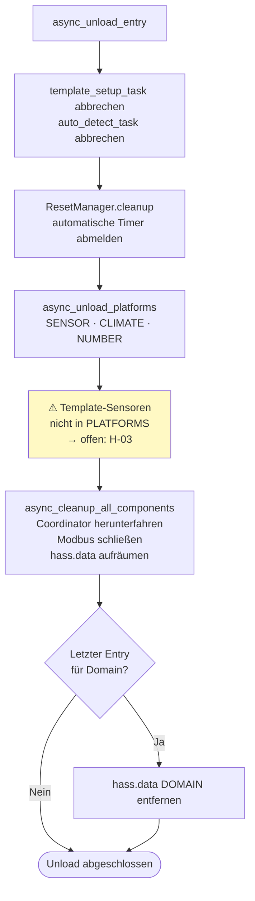

# Lambda Heat Pumps Integration – Ablaufdiagramm & Entwicklerreferenz

**Stand:** Release 2.3 · **Letzte Aktualisierung:** 2026-02-21

Dieses Dokument beschreibt den vollständigen Ablauf der Integration – von der Initialisierung bis zum laufenden Betrieb. Es dient als Referenz für zukünftige Entwicklung und Debugging.

---

## Inhaltsverzeichnis

1. [Schnellübersicht – wichtige Dateien](#1-schnellübersicht--wichtige-dateien)
2. [Setup-Ablauf](#2-setup-ablauf)
3. [Coordinator-Initialisierung](#3-coordinator-initialisierung)
4. [Platform-Setup und Entity-Klassen](#4-platform-setup-und-entity-klassen)
5. [Daten-Update-Zyklus](#5-daten-update-zyklus)
6. [Flankenerkennung (Edge Detection)](#6-flankenerkennung-edge-detection)
7. [Offset-Anwendung](#7-offset-anwendung)
8. [ResetManager – Periodische Resets](#8-resetmanager--periodische-resets)
9. [Unload und Reload](#9-unload-und-reload)
10. [Offene Probleme](#10-offene-probleme)

---

## 1. Schnellübersicht – wichtige Dateien

| Datei | Verantwortung | Wichtigste Klassen/Funktionen |
|---|---|---|
| `__init__.py` | Integration-Einstieg, Setup, Reload, Unload | `async_setup_entry`, `async_unload_entry`, `async_reload_entry` |
| `coordinator.py` | Modbus-Polling, Edge Detection, Persistenz | `LambdaDataUpdateCoordinator`, `_async_update_data`, `async_init` |
| `sensor.py` | Alle Sensor-Entities (5 Klassen), Platform-Setup | `LambdaSensor`, `LambdaCyclingSensor`, `LambdaEnergyConsumptionSensor`, `LambdaCOPSensor`, `LambdaYesterdaySensor` |
| `climate.py` | Thermostat-Entities | `LambdaClimateEntity` |
| `number.py` | Heizkurven, Offset-Nummern | `LambdaHeatingCurveNumber`, `LambdaFlowLineOffsetNumber`, `LambdaEcoTempReductionNumber` |
| `template_sensor.py` | Template-basierte Sensoren (Heizkurven-Visualisierung) | `LambdaTemplateSensor`, `LambdaHeatingCurveTemplateSensor` |
| `utils.py` | Hilfsfunktionen, Name-Generierung, Counter-Increment | `generate_sensor_names`, `increment_cycling_counter`, `increment_energy_consumption_counter` |
| `const.py` | Sensor-Templates, Konstanten | `HP_SENSOR_TEMPLATES`, `BOIL_SENSOR_TEMPLATES`, `HC_SENSOR_TEMPLATES` |
| `migration.py` | Versions-Migration, Duplikat-Cleanup | `async_migrate_entry`, `async_remove_duplicate_entity_suffixes` |
| `modbus_utils.py` | Modbus-Lesen/Schreiben mit Retry | `async_read_holding_registers`, `async_write_registers` |
| `reset_manager.py` | Zeitgesteuerte Resets (täglich, 2h, 4h, monatlich) | `ResetManager` |
| `services.py` | HA-Services, PV-Surplus, Raum-Thermostat | `async_setup_services` |
| `module_auto_detect.py` | Automatische Modul-Erkennung | `auto_detect_modules` |

**Persistente Dateien (zur Laufzeit erzeugt):**

| Datei | Inhalt |
|---|---|
| `{config_dir}/lambda_heat_pumps/cycle_energy_persist.json` | Zyklus-Zähler, Energie-Werte, letzte Betriebszustände |
| `{config_dir}/lambda_heat_pumps/lambda_wp_config.yaml` | Benutzer-Konfiguration (Offsets, externe Sensoren etc.) |

---

## 2. Setup-Ablauf


```mermaid
flowchart TD
    A([HA Start / Reload]) --> B[async_setup_entry]
    B --> C{Entry bereits geladen?}
    C -->|Ja| C1([Skip – return True])
    C -->|Nein| D[Coordinator erstellen\nLambdaDataUpdateCoordinator]
    D --> E[coordinator.async_init]
    E --> F{num_hps/num_hc\nin entry.data?}

    F -->|Neue Konfiguration| G[Blocking Auto-Detect\n3 Versuche × 5s]
    G --> G1[Modulzahlen in entry.data schreiben]

    F -->|Bestehende Konfiguration| H[Bestehende Modulzahlen verwenden]
    H --> H1[Background Auto-Detect starten\nhass.async_create_task]
    H1 --> H2{is_reload?}
    H2 -->|Ja| H3[38s warten]
    H2 -->|Nein| H4[Sofort starten]
    H3 --> H5[wait_for_stable_connection]
    H4 --> H5
    H5 --> H6[auto_detect_modules]
    H6 --> H7[update_entry_with_detected_modules\n→ triggert Reload via update_listener]
    H1 --> H8[Task-Referenz in\ncoordinator_data speichern]

    G1 --> I
    H --> I[Base-Adressen berechnen\ngenerate_base_addresses]
    I --> J[INT32-Register-Reihenfolge laden]
    J --> K[coordinator in hass.data speichern]
    K --> L[async_remove_duplicate_entity_suffixes\nBereinigung VOR Platform-Setup\nentfernt Überreste aus letzter Session]
    L --> M[async_forward_entry_setups\nSENSOR · CLIMATE · NUMBER]
    M --> M2[async_remove_duplicate_entity_suffixes\nBereinigung NACH Platform-Setup]
    M2 --> N[coordinator.async_refresh\nerster Daten-Update]
    N --> O{Services bereits\nregistriert?}
    O -->|Nein| P[async_setup_services]
    O -->|Ja| Q
    P --> Q[ResetManager erstellen\nund setup_reset_automations]
    Q --> R[update_listener registrieren\nasync_reload_entry als Callback]
    R --> S([Setup abgeschlossen])

    style A fill:#e1f5fe
    style S fill:#c8e6c9
    style C1 fill:#fff9c4
    style H7 fill:#fff9c4
```

> **Hinweis:** `background_auto_detect` → `update_entry_with_detected_modules` → Reload → neuer `background_auto_detect` ist eine potenzielle Reload-Schleife. Der alte Task wird beim Unload abgebrochen, bevor der neue startet.

---

## 3. Coordinator-Initialisierung

`coordinator.async_init()` wird direkt nach dem Erstellen des Coordinators aufgerufen.


```mermaid
flowchart LR
    A[async_init] --> B[_ensure_config_dir\nOrdner anlegen]
    B --> C[load_disabled_registers\naus lambda_wp_config.yaml]
    C --> D[_load_sensor_overrides\nSensor-Namenüberschreibungen]
    D --> E[homeassistant_started\nEvent-Listener registrieren]
    E --> F[_load_offsets_and_persisted]
    F --> F1[cycling_offsets laden]
    F --> F2[energy_consumption_offsets laden]
    F --> F3[cycle_energy_persist.json laden\nZähler, Energiewerte, letzte Zustände]
    F1 & F2 & F3 --> G[_connect\nModbus TCP verbinden]
    G --> H([Coordinator bereit])
```

**Geladene Daten aus `cycle_energy_persist.json`:**

| Schlüssel | Inhalt |
|---|---|
| `heating_cycles` | Zyklus-Zähler pro HP und Modus |
| `heating_energy` | Energie-Integralwerte |
| `energy_consumption` | Verbrauchswerte nach Modus und Periode |
| `last_operating_states` | Letzter Betriebszustand pro HP (für Flankenerkennung) |
| `last_states` | Letzter HP_STATE pro HP |
| `energy_offsets` | Zuletzt verwendete Energy-Offsets (nur zur Info) |

---

## 4. Platform-Setup und Entity-Klassen

### 4.1 Registrierte Platforms

```python
PLATFORMS = [Platform.SENSOR, Platform.CLIMATE, Platform.NUMBER]
# Template-Sensoren sind NICHT in PLATFORMS → werden nicht via async_unload_platforms entladen!
```

### 4.2 Sensor-Platform Setup-Reihenfolge (`sensor.py`)


```mermaid
flowchart TD
    A[async_setup_entry\nsensor.py] --> B[General Sensors erstellen\naus SENSOR_TYPES]
    B --> C[async_add_entities General\n→ Hauptgerät in Device-Registry]
    C --> D[asyncio.sleep 0.05s\nDevice-Registry stabilisieren]
    D --> E[Sub-Device-Sensoren erstellen\nHP · Boil · Buff · Sol · HC]
    E --> F[Cycling-Sensoren erstellen\nLambdaCyclingSensor]
    F --> G[Energy-Consumption-Sensoren\nLambdaEnergyConsumptionSensor]
    G --> H[COP-Sensoren\nLambdaCOPSensor]
    H --> I[Yesterday-Sensoren\nLambdaYesterdaySensor]
    I --> J[async_add_entities alle\nnicht-General Sensoren]
    J --> K[hass.async_create_task\nsetup_templates]
    K --> K2[Task-Referenz in\ncoordinator_data speichern]
    K2 --> L([Template-Task läuft\nim Hintergrund])

    style L fill:#fff9c4
```

> **Hinweis:** Template-Sensoren laufen als Hintergrund-Task und sind nicht in `PLATFORMS`. Der Task-Handle wird in `coordinator_data["template_setup_task"]` gespeichert und beim Unload abgebrochen.

### 4.3 Entity-Klassen-Übersicht


```mermaid
classDiagram
    class CoordinatorEntity {
        +coordinator: LambdaDataUpdateCoordinator
        +_handle_coordinator_update()
    }
    class RestoreEntity {
        +async_get_last_state()
    }
    class RestoreNumber {
        +async_get_last_number_data()
    }

    class LambdaSensor {
        +_attr_unique_id
        +entity_id
        +native_value: coordinator.data[key]
        +async_added_to_hass()
        +async_will_remove_from_hass()
    }
    CoordinatorEntity <|-- LambdaSensor
    SensorEntity <|-- LambdaSensor

    class LambdaCyclingSensor {
        +_cycling_value: int
        +_applied_offset: int
        +set_cycling_value()
        +_apply_cycling_offset()
        +async_added_to_hass()
    }
    RestoreEntity <|-- LambdaCyclingSensor
    SensorEntity <|-- LambdaCyclingSensor

    class LambdaEnergyConsumptionSensor {
        +_energy_value: float
        +_applied_offset: float
        +set_energy_value()
        +_apply_energy_offset()
        +async_added_to_hass()
    }
    RestoreEntity <|-- LambdaEnergyConsumptionSensor
    SensorEntity <|-- LambdaEnergyConsumptionSensor

    class LambdaCOPSensor {
        +_cop_value: float
        +set_cop_value()
    }
    RestoreEntity <|-- LambdaCOPSensor
    SensorEntity <|-- LambdaCOPSensor

    class LambdaYesterdaySensor {
        +_yesterday_value
    }
    RestoreEntity <|-- LambdaYesterdaySensor
    SensorEntity <|-- LambdaYesterdaySensor

    class LambdaTemplateSensor {
        +_unique_id
        +native_value: aus coordinator.data
    }
    CoordinatorEntity <|-- LambdaTemplateSensor
    SensorEntity <|-- LambdaTemplateSensor

    class LambdaClimateEntity {
        +_attr_unique_id
        +target_temperature
        +async_set_temperature()
    }
    CoordinatorEntity <|-- LambdaClimateEntity
    ClimateEntity <|-- LambdaClimateEntity

    class LambdaHeatingCurveNumber {
        +_attr_unique_id
    }
    RestoreNumber <|-- LambdaHeatingCurveNumber
    NumberEntity <|-- LambdaHeatingCurveNumber

    class LambdaFlowLineOffsetNumber {
        +_attr_unique_id
    }
    CoordinatorEntity <|-- LambdaFlowLineOffsetNumber
    RestoreNumber <|-- LambdaFlowLineOffsetNumber
    NumberEntity <|-- LambdaFlowLineOffsetNumber
```

### 4.4 Device-Hierarchie

```
Lambda WP (Hauptgerät)
│   identifiers: {(DOMAIN, entry_id)}
│   via_device: None
│
├── HP1, HP2, HP3    Wärmepumpen        Basis-Adresse: 1000 / 1100 / 1200
├── Boil1 – Boil5   Boiler             Basis-Adresse: 2000 – 2400
├── Buff1 – Buff5   Pufferspeicher     Basis-Adresse: 3000 – 3400
├── Sol1 – Sol2     Solar              Basis-Adresse: 4000 – 4100
└── HC1 – HC12      Heizkreise         Basis-Adresse: 5000 – 6100
```

Sub-Devices referenzieren das Hauptgerät via `via_device = (DOMAIN, entry_id)`.

---

## 5. Daten-Update-Zyklus

Der Coordinator pollt alle **30 Sekunden** (konfigurierbar) via `_async_update_data()`.


```mermaid
flowchart TD
    A([Timer-Tick\n30s Intervall]) --> B{hass.is_stopping?}
    B -->|Ja| B1([Letzten Datensatz zurückgeben])
    B -->|Nein| C[Globalen Register-Cache leeren]
    C --> D[wait_for_stable_connection\nModbus-Health-Check]
    D --> E[Firmware-Version ermitteln\nkompatible Sensor-Templates filtern]
    E --> F[_read_general_sensors_batch\nHauptgerät-Register]
    F --> G[_read_heatpump_sensors_batch\npro HP-Instanz]
    G --> H[Boiler-Register lesen\npro Boiler-Instanz]
    H --> I[Buffer-Register lesen\npro Buffer-Instanz]
    I --> J[Solar-Register lesen\npro Solar-Instanz]
    J --> K[HC-Register sammeln\nals globale Batch-Requests]
    K --> L[_read_all_registers_globally\noptimierter Sammel-Read]
    L --> M[Dummy-Keys für Template-Sensoren\nTimestamp einfügen]
    M --> N[Flankenerkennung operating_state\nRegister 1003 pro HP]
    N --> O[Flankenerkennung hp_state\nRegister 1002 pro HP]
    O --> P[_persist_counters\ndebounced, max 1x/30s]
    P --> Q[_track_energy_consumption\nelektrisch + thermisch]
    Q --> R([data-Dict zurückgeben\nEntities werden benachrichtigt])

    style B1 fill:#fff9c4
    style R fill:#c8e6c9
```

**Wichtig:** `_initialization_complete` muss `True` sein, damit Flanken erkannt werden. Dies verhindert falsche Zähler-Inkremente beim ersten Update nach dem Start.

---

## 6. Flankenerkennung (Edge Detection)

Die Flankenerkennung läuft innerhalb von `_async_update_data()` für **jeden Wärmepumpen-Index** (1 bis num_hps).


```mermaid
flowchart TD
    A[operating_state\naus Register 1003] --> B[last_operating_state\naus _last_operating_state dict]
    B --> C{_initialization_complete\nUND last != UNBEKANNT?}
    C -->|Nein| Z[Nur State speichern\nkein Zähler-Inkrement]
    C -->|Ja| D{Modus-Schleife\nheating=1 · hot_water=2\ncooling=3 · defrost=5}
    D --> E{last_state != mode_val\nUND current == mode_val?}
    E -->|Nein| F[Kein Flankenwechsel]
    E -->|Ja| G[FLANKENWECHSEL erkannt!\nModus X hat begonnen]
    G --> H[increment_cycling_counter\nhass · mode · hp_index\ncycling_offsets übergeben]
    H --> I[Energie-Integrationsstart\nenergy_hp_idx auf 0.0 setzen]
    I --> J[Letzten Zustand speichern]
    F --> J
    Z --> J
    J --> K([Nächster HP-Index\nbzw. Update-Ende])

    style G fill:#c8e6c9
    style H fill:#fff9c4
```

**Zwei parallele Flankenerkennung-Schleifen:**

| Register | Dict | Zweck |
|---|---|---|
| `hp{N}_operating_state` (1003) | `_last_operating_state` | Betriebsmodus-Wechsel → Zyklus-Zähler |
| `hp{N}_state` (1002) | `_last_state` | Kompressor-Start-Erkennung |

---

## 7. Offset-Anwendung

Offsets werden aus `lambda_wp_config.yaml` geladen und sollen **einmalig** auf Total-Sensoren addiert werden.


```mermaid
flowchart TD
    subgraph STARTUP [HA-Start / async_added_to_hass]
        A1[_cycling_value aus Restore] --> A2[_applied_offset aus State-Attributen\noder 0 wenn neu]
        A2 --> A3{_sensor_id endet\nauf _total?}
        A3 -->|Ja| A4[_apply_cycling_offset\nnur Differenz anwenden]
        A3 -->|Nein| A5[Kein Offset beim Start]
        A4 --> A6[_cycling_value += offset - applied\n_applied_offset = offset]
    end

    subgraph CYCLE [Zyklus-Event / increment_cycling_counter]
        B1[current = state.state] --> B2[offset aus YAML laden\nfür _total Sensoren]
        B2 --> B3[new_value = current + 1]
        B3 --> B4[final_value = new_value + offset]
        B4 --> B5[set_cycling_value final_value]
        B5 --> B6[⚠ FEHLER: offset erneut addiert\nobwohl bereits in current!]
    end

    subgraph CORRECT [Korrekte Implementierung\nfür Energie-Sensor]
        C1[current = _energy_value] --> C2[offset aus YAML]
        C2 --> C3[new_value = current + delta]
        C3 --> C4{_applied_offset != offset?}
        C4 -->|Ja| C5[new_value += offset - _applied_offset\n_applied_offset = offset]
        C4 -->|Nein| C6[Kein Offset-Zusatz]
        C5 --> C7[set_energy_value new_value]
        C6 --> C7
    end

    style B6 fill:#ffcdd2
    style CORRECT fill:#e8f5e9
    style CYCLE fill:#fff3e0
```

> **⚠ Bug B-1:** `increment_cycling_counter()` addiert den vollen YAML-Offset bei jedem Zyklus-Event (utils.py:901). Details → [offset_bug_analysis.md](../../analysis/offset_bug_analysis.md)

---

## 8. ResetManager – Periodische Resets

Der `ResetManager` (reset_manager.py) meldet sich bei HA-Zeitereignissen an und sendet Dispatcher-Signale, die von den Sensor-Entities empfangen werden.


```mermaid
flowchart LR
    subgraph REGISTER [setup_reset_automations]
        R1[async_track_time_change\nfür jedes Zeitschema]
    end

    subgraph SCHEDULES [Zeitpläne]
        S1[Täglich 00:00\nYesterday-Update\ndann Daily-Reset]
        S2[2-Stündlich\n00:00·02:00·04:00…22:00]
        S3[4-Stündlich\n00:00·04:00·08:00…20:00]
        S4[Stündlich]
        S5[Monatlich\n1. des Monats]
        S6[Jährlich\n1. Januar]
    end

    subgraph SIGNALS [Dispatcher-Signale]
        D1[SIGNAL_DAILY_RESET]
        D2[SIGNAL_2H_RESET]
        D3[SIGNAL_4H_RESET]
        D4[SIGNAL_HOURLY_RESET]
        D5[SIGNAL_MONTHLY_RESET]
        D6[SIGNAL_YEARLY_RESET]
    end

    R1 --> SCHEDULES
    S1 --> D1
    S2 --> D2
    S3 --> D3
    S4 --> D4
    S5 --> D5
    S6 --> D6

    D1 & D2 & D3 & D4 & D5 & D6 -->|async_dispatcher_send| E[LambdaEnergyConsumptionSensor\nreagiert auf Signal und resettet\n_energy_value für Periode]
```

**Beim Unload:** `reset_manager.cleanup()` meldet alle Timer-Callbacks ab.

---

## 9. Unload und Reload

### Unload


```mermaid
flowchart TD
    A[async_unload_entry] --> T[template_setup_task abbrechen\nauto_detect_task abbrechen]
    T --> B[ResetManager.cleanup\nautomatische Timer abmelden]
    B --> C[async_unload_platforms\nSENSOR · CLIMATE · NUMBER]
    C --> D[⚠ Template-Sensoren\nnicht in PLATFORMS\n→ offen: H-03]
    D --> E[async_cleanup_all_components\nCoordinator herunterfahren\nModbus schließen\nhass.data aufräumen]
    E --> F{Letzter Entry\nfür Domain?}
    F -->|Ja| G[hass.data DOMAIN entfernen]
    F -->|Nein| H([Unload abgeschlossen])
    G --> H

    style D fill:#fff9c4
```

### Reload

```mermaid
flowchart TD
    A[async_reload_entry\nausgelöst durch update_listener] --> B{_entry_reload_flags\nentry_id gesetzt?}
    B -->|Ja| C([Skip – return True])
    B -->|Nein| D[Pro-Entry Lock acquire\n_entry_reload_flags\[entry_id\] = True]
    D --> E[async_unload_entry]
    E --> F[async_setup_entry]
    F --> G[_entry_reload_flags\[entry_id\] = False\nin finally-Block]
    G --> H([Reload abgeschlossen])

    style C fill:#fff9c4
```

> **Reload-Schutz:** `_entry_reload_locks` und `_entry_reload_flags` sind Dicts, die pro `entry_id` einen eigenen Lock/Flag bereitstellen. Verschiedene Config-Entries blockieren sich nicht gegenseitig.

---

## 10. Offene Probleme

| # | Schweregrad | Kurzbeschreibung | Ort | Analyse |
|---|---|---|---|---|
| B-1 | **Kritisch** | Cycling-Offset bei jedem Zyklus-Event erneut addiert → exponentieller Wertzuwachs | utils.py:901 | [offset_bug_analysis.md](../../analysis/offset_bug_analysis.md) |
| B-2 | Mittel | Daily-Offset alle 30s in Coordinator-Data-Dict geschrieben | coordinator.py:1974 | [offset_bug_analysis.md](../../analysis/offset_bug_analysis.md) |
| H-03 | Hoch | Template-Sensoren nicht in PLATFORMS → werden beim Unload nicht vollständig entladen | __init__.py:43 | [integration_analysis.md](../../analysis/integration_analysis.md) |

Vollständige Analyse: [docs/analysis/integration_analysis.md](../../analysis/integration_analysis.md)

---

## Anhang: Modbus-Kommunikation

```
AsyncModbusTcpClient (pymodbus >= 3.6.0)
│
├── _modbus_read_lock (global asyncio.Lock)
│   Verhindert parallele Requests → Transaction-ID-Konflikte
│
├── async_read_holding_registers(client, address, count, slave_id)
│   ├── 3 Retry-Versuche
│   ├── asyncio.wait_for(... timeout=LAMBDA_MODBUS_TIMEOUT)
│   └── Sonderbehandlung bei hass.is_stopping
│
└── Batch-Optimierung in _async_update_data
    ├── _global_register_cache: vermeidet doppelte Reads pro Zyklus
    ├── _batch_failures: nach 3 Fehlern → Einzellesungen statt Batch
    └── _enabled_addresses: nur aktiv genutzte Adressen werden gelesen
```

**Modbus-Adressschema:**

```
General (Hauptgerät):  0 –  999
HP1:                1000 – 1099    HP2: 1100–1199    HP3: 1200–1299
Boil1:              2000 – 2099    Boil2: 2100–2199  …  Boil5: 2400–2499
Buff1:              3000 – 3099    …                     Buff5: 3400–3499
Sol1:               4000 – 4099    Sol2: 4100–4199
HC1:                5000 – 5099    HC2: 5100–5199    …  HC12: 6100–6199
```

---

*Dieses Dokument wurde auf Basis des tatsächlichen Quellcodes von Release 2.3 erstellt und ersetzt die veraltete Version.*
