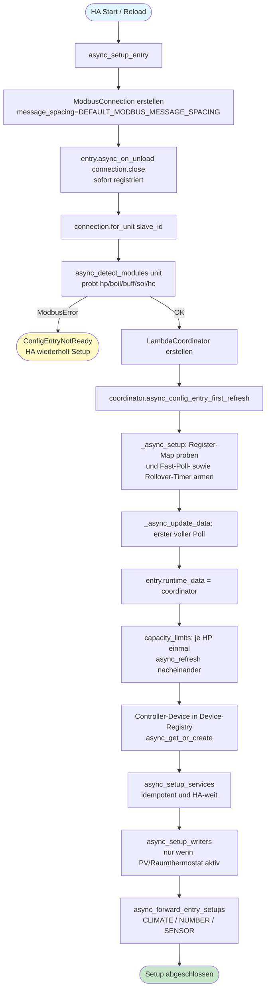
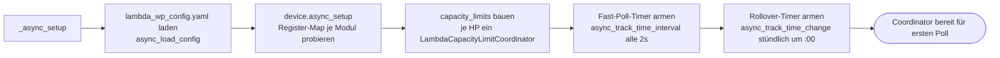
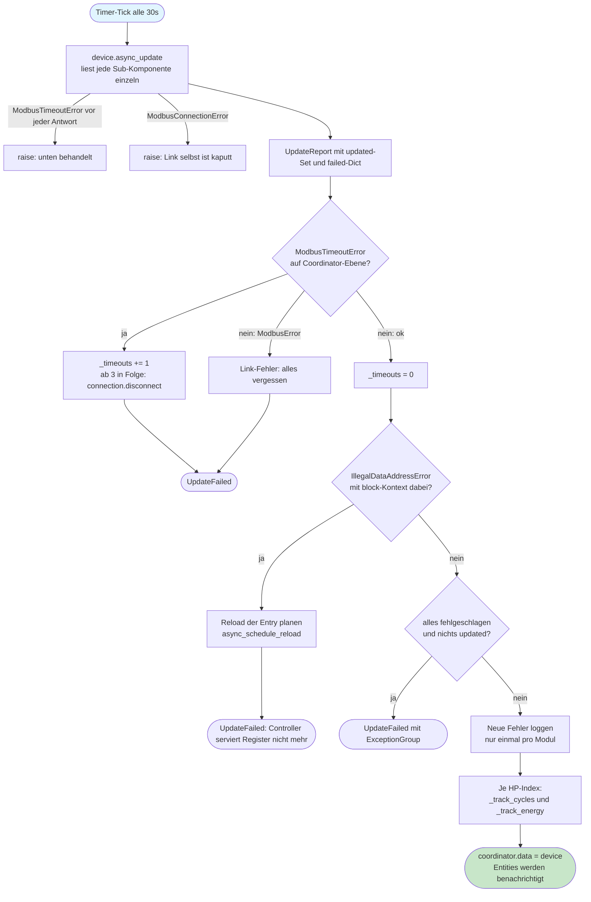
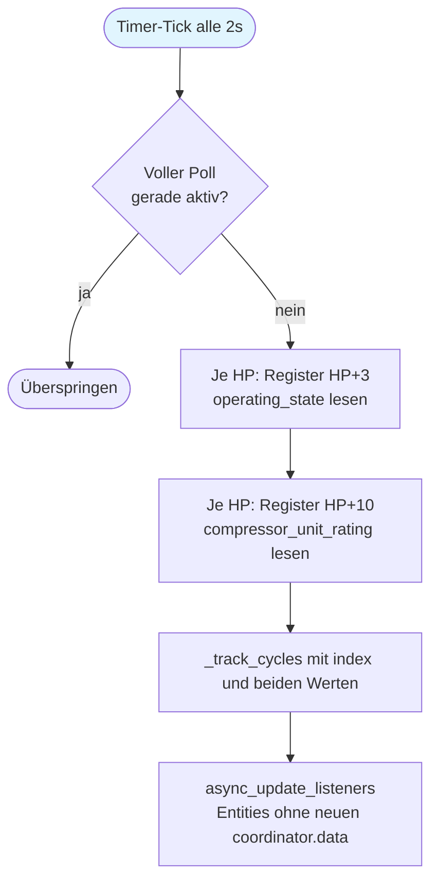
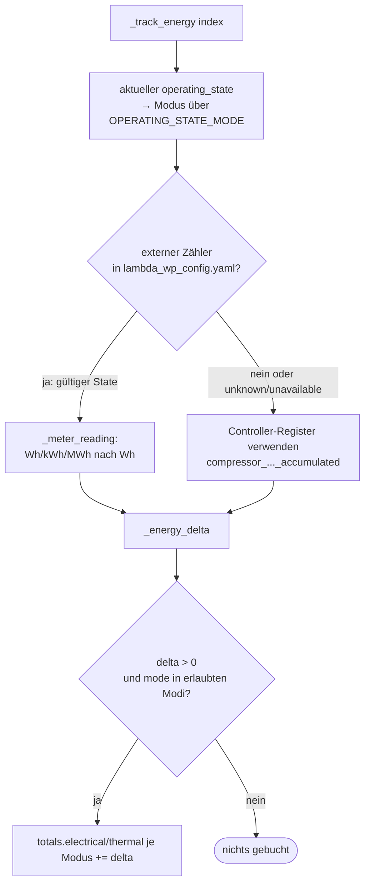
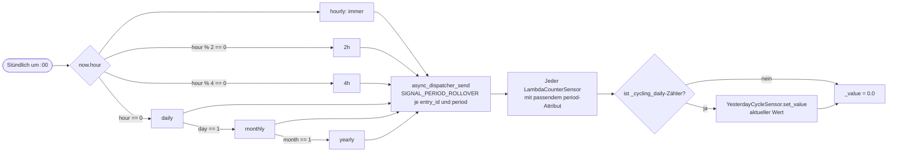

# Lambda Heat Pumps Integration – Ablaufdiagramm & Entwicklerreferenz

*Zuletzt geändert am 06.09.2026*

**Stand:** Release 3.5.2 (Rewrite auf [`modbus-connection`](https://github.com/home-assistant-libs/modbus-connection)/`tmodbus`, Branch `3.5`; Hintergrund zum Rewrite: [Issue #99](https://github.com/GuidoJeuken-6512/lambda_heat_pumps/issues/99))

Dieses Dokument beschreibt den vollständigen Ablauf der Integration – von der
Initialisierung bis zum laufenden Betrieb. Es dient als Referenz für zukünftige
Entwicklung und Debugging.

---

## Inhaltsverzeichnis

1. [Schnellübersicht – wichtige Dateien](#1-schnellübersicht--wichtige-dateien)
2. [Setup-Ablauf](#2-setup-ablauf)
3. [Coordinator-Initialisierung (`_async_setup`)](#3-coordinator-initialisierung-_async_setup)
4. [Entity-Klassen und Device-Hierarchie](#4-entity-klassen-und-device-hierarchie)
5. [Voller Poll-Zyklus (`_async_update_data`)](#5-voller-poll-zyklus-_async_update_data)
6. [Schneller Poll und Flankenerkennung](#6-schneller-poll-und-flankenerkennung)
7. [Energie-Tracking](#7-energie-tracking)
8. [Perioden-Rollover (Zähler-Reset)](#8-perioden-rollover-zähler-reset)
9. [Offset-Anwendung](#9-offset-anwendung)
10. [Unload und Migration](#10-unload-und-migration)
11. [Modbus-Adressschema](#11-modbus-adressschema)

---

## 1. Schnellübersicht – wichtige Dateien

| Datei | Verantwortung | Wichtigste Klassen/Funktionen |
|---|---|---|
| `__init__.py` | Setup, Unload, Entry-Migration | `async_setup_entry`, `async_unload_entry`, `async_migrate_entry` |
| `coordinator.py` | Poll-Loop (voll + schnell), Cycle-/Energie-Tracking, Perioden-Rollover | `LambdaCoordinator`, `LambdaCapacityLimitCoordinator`, `Totals` |
| `entity.py` | Gemeinsame Basis aller Entities: unique_id, device_info, Verfügbarkeit | `LambdaEntity` |
| `sensor.py` | Register-, Zähler-, COP- und Heizkurven-Sensoren | `LambdaSensor`, `LambdaTotalSensor`, `LambdaCounterSensor`, `LambdaCopSensor`, `LambdaHeatingCurveSensor` |
| `climate.py` | Thermostat-Entities (Warmwasser, Heiz-/Kühlkreis) | `LambdaClimate` |
| `number.py` | Heizkurven-Stützpunkte, Eco-Reduktion, Flow-Line-Offset | `LambdaSettingNumber`, `LambdaFlowLineOffsetNumber` |
| `services.py` | PV-Überschuss- und Raumthermostat-Schreiber, Modbus-Debug-Services | `async_setup_services`, `async_setup_writers` |
| `module_auto_detect.py` | Einmalige Modul-Erkennung beim Setup | `async_detect_modules` |
| `firmware.py` | Firmware→Register-Kompatibilität | `firmware_level`, `serves`, `default_register_order` |
| `config_file.py` | `lambda_wp_config.yaml` (Offsets, externe Zähler) | `LambdaFileConfig`, `async_load` |
| `diagnostics.py` | Rohregister-Dump für den Diagnose-Download | `async_get_config_entry_diagnostics` |
| `lambda_modbus/` | Das Register-Modell selbst (Modbus-Client-neutral, kein HA-Import) | `LambdaHeatPump`, `HeatPump`, `Boiler`, `Buffer`, `Solar`, `HeatingCircuit`, `Ambient`, `EManager` |

**Was es nicht mehr gibt** (ersatzlos, nicht umbenannt): `modbus_utils.py`,
`utils.py`, `migration.py`, `reset_manager.py`, `automations.py`,
`template_sensor.py`, `const_base.py`/`const_sensor.py`/`const_migration.py`,
`cycle_energy_persist.json`. Siehe Abschnitt 10 und
[Migrationssystem](migration-system.md) für den heutigen Ersatz.

---

## 2. Setup-Ablauf


```mermaid
flowchart TD
    A([HA Start / Reload]) --> B[async_setup_entry]
    B --> C[ModbusConnection erstellen\nmessage_spacing=DEFAULT_MODBUS_MESSAGE_SPACING]
    C --> D[entry.async_on_unload connection.close\nsofort registriert]
    D --> E[connection.for_unit slave_id]
    E --> F[async_detect_modules unit\nprobt hp/boil/buff/sol/hc]
    F -->|ModbusError| F1([ConfigEntryNotReady\nHA wiederholt Setup])
    F -->|OK| G[LambdaCoordinator erstellen]
    G --> H[coordinator.async_config_entry_first_refresh]
    H --> H1[_async_setup: Register-Map proben\nund Fast-Poll- sowie Rollover-Timer armen]
    H1 --> H2[_async_update_data: erster voller Poll]
    H2 --> I[entry.runtime_data = coordinator]
    I --> J[capacity_limits: je HP einmal\nasync_refresh nacheinander]
    J --> K[Controller-Device in Device-Registry\nasync_get_or_create]
    K --> L[async_setup_services\nidempotent und HA-weit]
    L --> M[async_setup_writers\nnur wenn PV/Raumthermostat aktiv]
    M --> N[async_forward_entry_setups\nCLIMATE / NUMBER / SENSOR]
    N --> O([Setup abgeschlossen])

    style A fill:#e1f5fe
    style O fill:#c8e6c9
    style F1 fill:#fff9c4
```

**Kein Reload-Schutz, kein Hintergrund-Scan mehr nötig:** Die Modulzahlen
werden bei **jedem** Setup neu geprobt (`async_detect_modules`) und nicht mehr
in `entry.data` zwischengespeichert – ein Reload nach einer reinen
Optionen-Änderung liest also ohnehin dieselben Werte erneut. Es gibt daher
weder `skip_auto_detect` noch einen Hintergrund-Task, der mit einer neuen
Coordinator-Generation um ein globales Lock konkurrieren könnte (das globale
`_modbus_read_lock` aus `modbus_utils.py` existiert nicht mehr; Serialisierung
läuft über den Pacer der `modbus-connection`-Bibliothek, siehe
[Modbus-Serialisierung](modbus-serialisierung.md)).

Schlägt `async_detect_modules` fehl (Controller nicht erreichbar), wirft
`async_setup_entry` `ConfigEntryNotReady` – Home Assistants eigener
Retry-Mechanismus übernimmt, es gibt keine eigene Wiederholungslogik.

Eine Options-Änderung lädt die Integration selbst neu, weil
`LambdaOptionsFlow` von `OptionsFlowWithReload` erbt – dafür ist kein
`update_listener` in `__init__.py` nötig.

---

## 3. Coordinator-Initialisierung (`_async_setup`)

`DataUpdateCoordinator` ruft `_async_setup()` einmalig auf, bevor der erste
`_async_update_data()`-Zyklus läuft (ausgelöst durch
`async_config_entry_first_refresh()` in Abschnitt 2):


```mermaid
flowchart LR
    A[_async_setup] --> B[lambda_wp_config.yaml laden\nasync_load_config]
    B --> C[device.async_setup\nRegister-Map je Modul probieren]
    C --> D[capacity_limits bauen\nje HP ein LambdaCapacityLimitCoordinator]
    D --> E[Fast-Poll-Timer armen\nasync_track_time_interval alle 2s]
    E --> F[Rollover-Timer armen\nasync_track_time_change stündlich um :00]
    F --> G([Coordinator bereit für ersten Poll])
```

**Register-Map-Probing** (`LambdaHeatPump.async_setup` in
`lambda_modbus/__init__.py`): Für jedes Modul wird jeder deklarierte
Adressbereich (`ranges.py`) zunächst als **ein** Block-Read versucht. Lehnt der
Controller den Block ab (`IllegalDataAddressError`), wird derselbe Bereich
Register für Register einzeln erneut gelesen – die Register, die einzeln
beantwortet werden, bleiben Teil des Modells; die anderen werden aus dem
Lese-Plan der Komponente entfernt (`restrict_fields`) und liefern fortan
`None`, statt bei jedem Poll erneut abgelehnt zu werden. Diese Probe läuft
**einmal pro Setup**, nicht bei jedem Poll.

Sowohl der Fast-Poll-Timer als auch der Rollover-Timer werden über
`entry.async_on_unload(...)` registriert – sie melden sich beim Unload also
automatisch ab, ohne dass `async_unload_entry` dafür eigenen Code braucht
(siehe Abschnitt 10).

---

## 4. Entity-Klassen und Device-Hierarchie

### 4.1 Gemeinsame Basis: `LambdaEntity` (`entity.py`)

Jede Entity kennt ihr Modul (`module`, z. B. `"hp"`) und ihren 1-basierten
Index, oder beide `None` für eine Entity, die zum Controller selbst gehört.
`LambdaEntity.__init__` setzt daraus:

- **`unique_id`** – im Legacy-Modus (`use_legacy_modbus_names=True`, alle vor
  3.5 angelegten Einträge) `{name_prefix}_{module}{index}_{key}`, sonst
  (Einträge ab 3.5) `{module}{index}_{key}` **ohne** `name_prefix`. Diese Form
  ist unveränderlich – siehe die ausführliche Begründung im Docstring von
  `entity.py`.
- **`entity_id`-Vorschlag** – aus dem unübersetzten Register-Schlüssel
  gebildet (`slugify(f"{prefix}_{module}{index}_{key}")`), nicht aus dem
  übersetzten Anzeigenamen. Das hält die `entity_id` sprachunabhängig und
  verhindert Kollisionen wie bei „Heizkurve-22°C“ vs. „Heizkurve+22°C“, die
  sonst beide zu `heizkurve22c` sluggen würden. Es ist nur ein **Vorschlag**:
  eine bereits registrierte Entity behält ihre bestehende `entity_id`.
- **`available`** – `True`, wenn die Entity kein Modul benennt (abgeleitete
  Werte, Zähler, vom Nutzer gesetzte Werte bleiben immer verfügbar), sonst
  `coordinator.available and modul_name not in coordinator.failed`.

### 4.2 Device-Hierarchie

```
Controller (identifiers={DOMAIN, entry_id})
│
├── HP1..HP3    via_device_id → Controller   Basis-Adresse 1000/1100/1200
├── Boil1..5    via_device_id → Controller   Basis-Adresse 2000..2400
├── Buff1..5    via_device_id → Controller   Basis-Adresse 3000..3400
├── Sol1..2     via_device_id → Controller   Basis-Adresse 4000/4100
└── HC1..12     via_device_id → Controller   Basis-Adresse 5000..6100
```

`via_device_id` (die Registry-UUID des Controller-Devices) wird verwendet statt
des veralteten `via_device` (Identifiers-Tupel) – der Controller wird in
`__init__.py` **vor** den Plattformen angelegt, daher existiert er bereits, wenn
`device_info()` für ein Modul aufgerufen wird. `ambient` und `e_manager` haben
kein eigenes Sub-Device; ihre Sensoren hängen direkt am Controller.

### 4.3 Entity-Klassen


```mermaid
classDiagram
    class LambdaEntity {
        +unique_id
        +entity_id: nur ein Vorschlag
        +available
    }
    class LambdaRegisterEntity {
        +_field(coordinator)
        +_read()
    }
    LambdaEntity <|-- LambdaRegisterEntity

    class LambdaSensor {
        +native_value: direkt vom Modell
    }
    LambdaRegisterEntity <|-- LambdaSensor

    class LambdaTotalSensor {
        +restore across Neustart
        +ignoriert 32-Bit-Carry-Ausreißer
    }
    LambdaRegisterEntity <|-- LambdaTotalSensor

    class LambdaCapacityLimitSensor {
        +eigener Coordinator: stündlich
    }
    LambdaRegisterEntity <|-- LambdaCapacityLimitSensor

    class LambdaCounterSensor {
        +_value / _counted / _applied_offset
        +restore + Rollover-Signal
    }
    LambdaEntity <|-- LambdaCounterSensor

    class YesterdayCycleSensor {
        +übernimmt Tageszähler beim Rollover
    }
    LambdaEntity <|-- YesterdayCycleSensor

    class LambdaCopSensor {
        +thermal / electrical Paar
        +kein eigener Zustand
    }
    LambdaEntity <|-- LambdaCopSensor

    class LambdaLifetimeCopSensor {
        +Controller-eigene Lifetime-Register
    }
    LambdaEntity <|-- LambdaLifetimeCopSensor

    class LambdaHeatingCurveSensor {
        +Interpolation + Korrekturen
    }
    LambdaEntity <|-- LambdaHeatingCurveSensor

    class LambdaClimate {
        +current_temperature / target_temperature
    }
    LambdaEntity <|-- LambdaClimate

    class LambdaSettingNumber {
        +publiziert an coordinator.settings
    }
    LambdaEntity <|-- LambdaSettingNumber

    class LambdaFlowLineOffsetNumber {
        +Register-Schreibzugriff
    }
    LambdaEntity <|-- LambdaFlowLineOffsetNumber
```

`LambdaSensor` vs. `LambdaTotalSensor`: `sensor.py::_register_sensor()`
entscheidet anhand `description.is_total` (State-Class `TOTAL`/
`TOTAL_INCREASING`), welche der beiden Klassen erzeugt wird – nur ein Total
lohnt sich für Home Assistants Restore-Mechanismus, der sonst *jede* damit
registrierte Entity zeitgesteuert auf die Platte schreibt.

---

## 5. Voller Poll-Zyklus (`_async_update_data`)

Läuft alle **30 Sekunden** (`CONF_UPDATE_INTERVAL`, konfigurierbar über die
Optionen).


```mermaid
flowchart TD
    A([Timer-Tick alle 30s]) --> B[device.async_update\nliest jede Sub-Komponente einzeln]
    B -->|ModbusTimeoutError vor jeder Antwort| C1[raise: unten behandelt]
    B -->|ModbusConnectionError| C2[raise: Link selbst ist kaputt]
    B --> D[UpdateReport mit updated-Set und failed-Dict]
    D --> E{ModbusTimeoutError\nauf Coordinator-Ebene?}
    E -->|ja| F[_timeouts += 1\nab 3 in Folge: connection.disconnect]
    E -->|nein: ModbusError| G[Link-Fehler: alles vergessen]
    E -->|nein: ok| H[_timeouts = 0]
    F --> Z1([UpdateFailed])
    G --> Z1
    H --> I{IllegalDataAddressError\nmit block-Kontext dabei?}
    I -->|ja| J[Reload der Entry planen\nasync_schedule_reload]
    J --> Z2([UpdateFailed: Controller serviert Register nicht mehr])
    I -->|nein| K{alles fehlgeschlagen\nund nichts updated?}
    K -->|ja| Z3([UpdateFailed mit ExceptionGroup])
    K -->|nein| L[Neue Fehler loggen\nnur einmal pro Modul]
    L --> M[Je HP-Index:\n_track_cycles und _track_energy]
    M --> N([coordinator.data = device\nEntities werden benachrichtigt])

    style A fill:#e1f5fe
    style N fill:#c8e6c9
```

**Wiederverbindung ist implizit:** Ein Timeout dreimal in Folge trennt die
Verbindung (`connection.disconnect()`); die nächste Anfrage von
`modbus-connection` baut sie automatisch wieder auf – über dieselben
`ModbusUnit`-Handles, es wird nichts im Modell neu aufgebaut.

**Registerkarte veraltet:** Ein `IllegalDataAddressError` mit gesetztem
`block` (kommt aus einem Modell-Read, nicht aus einem manuellen
`read_modbus_register`-Service-Aufruf) bedeutet: Der Controller serviert ein
Register nicht mehr, das er beim Setup noch bediente – Firmware-Wechsel oder
Modul entfernt. Statt das im laufenden Betrieb zu reparieren, plant der
Coordinator einen Reload der Entry, der die Registerkarte über
`async_detect_modules` + `device.async_setup()` komplett neu probt.

---

## 6. Schneller Poll und Flankenerkennung

Der Fast-Poll (`_async_fast_poll`, Default alle **2 Sekunden**,
`CONF_FAST_UPDATE_INTERVAL`) liest **nur** zwei Register pro Wärmepumpe direkt
über `unit.read_holding_registers` – am Modell vorbei, ohne die übrige
Sub-Komponente zu berühren:


```mermaid
flowchart TD
    A([Timer-Tick alle 2s]) --> B{Voller Poll\ngerade aktiv?}
    B -->|ja| Z([Überspringen])
    B -->|nein| C[Je HP: Register HP+3\noperating_state lesen]
    C --> D[Je HP: Register HP+10\ncompressor_unit_rating lesen]
    D --> E[_track_cycles mit index und beiden Werten]
    E --> F[async_update_listeners\nEntities ohne neuen coordinator.data]

    style A fill:#e1f5fe
```

`_track_cycles` erkennt zwei unabhängige Flanken:

| Flanke | Vergleich | Ergebnis |
|---|---|---|
| Betriebsmodus-Wechsel | `_last_operating_state[index]` ≠ neuer Wert, gemappt über `OPERATING_STATE_MODE` | `totals.cycles[mode] += 1`, sofern `mode` in `CYCLE_MODES` |
| Kompressorstart | `_last_compressor_running[index]` war `False`, jetzt `True` | `totals.cycles["compressor_start"] += 1` |

Der volle Poll ruft `_track_cycles` mit denselben Argumenten ebenfalls auf –
ein Kompressorstart, der komplett innerhalb eines 30-Sekunden-Fensters beginnt
**und** endet, würde vom vollen Poll allein verpasst; beide Aufrufe teilen sich
dieselben `_last_*`-Dicts, ein Ereignis wird also nie doppelt gezählt, egal
welcher Poll es zuerst sieht.

`Totals` (siehe `coordinator.py`) zählt **seit dem Start von Home Assistant**,
nicht seit Installation der Wärmepumpe – die absoluten Werte liefert erst die
Sensor-Schicht (`LambdaCounterSensor`), die ihren eigenen Stand über einen
Neustart hinweg restauriert und die Differenz seit dem letzten Blick auf
`Totals` addiert (Details: [Features – Cycling- und Energie-Zähler](features.md),
Offset-Anwendung: Abschnitt 9 unten).

---

## 7. Energie-Tracking

`_track_energy` läuft nur im vollen Poll, einmal je Wärmepumpe, für
**elektrisch** und **thermisch** parallel:


```mermaid
flowchart TD
    A[_track_energy index] --> B[aktueller operating_state\n→ Modus über OPERATING_STATE_MODE]
    B --> C{externer Zähler\nin lambda_wp_config.yaml?}
    C -->|ja: gültiger State| D[_meter_reading:\nWh/kWh/MWh nach Wh]
    C -->|nein oder unknown/unavailable| E[Controller-Register verwenden\ncompressor_..._accumulated]
    D --> F[_energy_delta]
    E --> F
    F --> G{delta > 0\nund mode in erlaubten Modi?}
    G -->|ja| H[totals.electrical/thermal je Modus += delta]
    G -->|nein| I([nichts gebucht])
```

`_energy_delta` liefert **0.0**, wenn der Messwert nicht als Fortsetzung des
letzten vertraut werden kann:

- keine Ablesung, oder ≤ 0 (Controller meldet 0 während des Boot-Vorgangs),
- erste Ablesung überhaupt (nur Baseline setzen, kein Delta),
- Wert kleiner als der letzte (Zähler zurückgesetzt oder Gerät getauscht),
- Sprung größer als `MAX_ENERGY_DELTA_KWH` (100 kWh) – ein einzelner Poll kann
  legitimerweise nie mehr addieren.

**Elektrisch** wird auch im Standby gebucht (`ELECTRICAL_ENERGY_MODES` enthält
`stby`), **thermisch** nicht – eine Wärmepumpe erzeugt im Leerlauf keine Wärme
(`THERMAL_ENERGY_MODES`).

**Externer Zähler statt Controller-Register:** `LambdaFileConfig.meter(index,
thermal)` liefert die konfigurierte `entity_id`, falls die HP in
`lambda_wp_config.yaml` unter `energy_consumption_sensors` einen eigenen Zähler
hat (Shelly, Wärmemengenzähler, …). Ist der State `unknown`/`unavailable`, wird
für diesen Poll **nichts** gebucht – nicht auf das Controller-Register
zurückgefallen, das etwas anderes misst und beim Wiedererscheinen des externen
Zählers sonst einen Sprung erzeugen würde.

---

## 8. Perioden-Rollover (Zähler-Reset)

Statt eines `ResetManager` mit einem Timer pro Periode gibt es **einen**
stündlichen Timer (`async_track_time_change(..., minute=0, second=0)`), der
über `_periods_ending(now)` ermittelt, welche Perioden genau in dieser Stunde
enden:


```mermaid
flowchart LR
    A([Stündlich um :00]) --> B{now.hour}
    B --> C[hourly: immer]
    B -->|hour % 2 == 0| D[2h]
    B -->|hour % 4 == 0| E[4h]
    B -->|hour == 0| F[daily]
    F -->|day == 1| G[monthly]
    G -->|month == 1| H[yearly]
    C & D & E & F & G & H --> I[async_dispatcher_send\nSIGNAL_PERIOD_ROLLOVER je entry_id und period]
    I --> J[Jeder LambdaCounterSensor\nmit passendem period-Attribut]
    J --> K{ist _cycling_daily-Zähler?}
    K -->|ja| L[YesterdayCycleSensor.set_value\naktueller Wert]
    K -->|nein| M[_value = 0.0]
    L --> M
```

Jeder `LambdaCounterSensor` abonniert in `async_added_to_hass` **nur** das
Signal seiner eigenen Periode (nicht alle sechs) – ein Total-Sensor
(`period == PERIOD_TOTAL`) abonniert gar keins, er wird nie zurückgesetzt.

---

## 9. Offset-Anwendung

Ein manueller Offset (nach Pumpentausch, oder um historische Zählerstände
fortzuführen) wirkt **nur** auf `*_total`-Zähler, nie auf Perioden-Zähler:

```python
# sensor.py – LambdaCounterSensor._apply_offset(), aufgerufen in async_added_to_hass
def _apply_offset(self) -> None:
    if self.entity_description.period != PERIOD_TOTAL:
        return
    offset = self.coordinator.file_config.offset(
        self._index, self.entity_description.key
    )
    self._value += offset - self._applied_offset
    self._applied_offset = offset
```

`self._applied_offset` wird als State-Attribut (`applied_offset`) persistiert
und beim Neustart zurückgelesen – ändert sich der konfigurierte Offset nach
einem Neustart, wird nur die **Differenz** zum vorher angewendeten Wert
addiert, nie der volle Betrag erneut. Details und Beispiele:
[Offset-System](offset-system.md).

---

## 10. Unload und Migration

### Unload

`async_unload_entry` besteht aus **einer** Zeile:

```python
async def async_unload_entry(hass: HomeAssistant, entry: LambdaConfigEntry) -> bool:
    return await hass.config_entries.async_unload_platforms(entry, PLATFORMS)
```

Alles andere – Verbindung schließen, Fast-Poll- und Rollover-Timer abmelden,
den PV-/Raumthermostat-Schreiber stoppen – läuft über
`entry.async_on_unload(...)`-Callbacks, die beim Setup registriert wurden
(Abschnitte 2 und 3, sowie der Schreib-Timer aus
[Features – PV-Überschuss und Raumthermostat](features.md)). Home Assistant
ruft sie automatisch auf, in umgekehrter Registrierungsreihenfolge, sobald die
Entry entladen wird. Es gibt kein Entity-Duplikat-Cleanup mehr, das
beim Setup laufen müsste – Home Assistants eigene `_2`/`_3`-Suffix-Auflösung
genügt, weil `entity_id` nur noch ein *Vorschlag* ist (Abschnitt 4.1) und
`unique_id` sich nie ändert.

### Migration (`async_migrate_entry`)

Ein Versionszähler (`ENTRY_VERSION = 9` in `const.py`) ersetzt das alte
`MigrationVersion`-Enum-System. Eine Entry mit `entry.version < ENTRY_VERSION`
wird einmalig aktualisiert:

| Schritt | Zweck |
|---|---|
| `num_hps`/`num_boil`/… aus `entry.data` entfernen | Modulzahlen werden jetzt bei jedem Setup neu geprobt, nicht mehr gespeichert |
| `port`/`slave_id` zu `int` | Der Nummern-Selector lieferte früher `float` |
| `use_legacy_modbus_names` auf `True` setzen, falls fehlend | Jede Entry vor 3.5 nutzte Namen mit Präfix |
| `firmware_version` von `options` nach `data` verschieben | Uneinheitlicher Speicherort in älteren Versionen |
| `int32_register_order` in die Optionen übernehmen | Einmaliger Fallback: liest die **alte** `lambda_wp_config.yaml` (`modbus.int32_register_order` bzw. das noch ältere `int32_byte_order`) über `_async_read_register_order`, falls die Option noch nicht gesetzt ist |

Alles, was früher in `lambda_wp_config.yaml` unter `disabled_registers`,
`sensors_names_override` oder `modbus` stand, hat heute eine native
Home-Assistant-Entsprechung (Entity deaktivieren/umbenennen in der
Entity-Registry) oder liegt in den Optionen (`int32_register_order`) – die
Datei selbst existiert nur noch für die drei Dinge, die keinen HA-eigenen Weg
haben: Cycling-/Energie-Offsets und externe Energiezähler
(siehe [modbus-wp-config.md](modbus-wp-config.md)).

---

## 11. Modbus-Adressschema

```
Ambient (Controller):    0 –   4
E-Manager (Controller): 100 – 104
HP1:    1000 – 1099    HP2: 1100–1199    HP3: 1200–1299
Boil1:  2000 – 2099    Boil2: 2100–2199  …  Boil5: 2400–2499
Buff1:  3000 – 3099    …                     Buff5: 3400–3499
Sol1:   4000 – 4099    Sol2: 4100–4199
HC1:    5000 – 5099    HC2: 5100–5199    …  HC12: 6100–6199
```

Innerhalb eines 100-Register-Blocks liest das Modell nicht den ganzen Block,
sondern nur die tatsächlich belegten, zusammenhängenden Läufe (`ranges.py`,
z. B. beim Heizkreis `0–6`, `7` einzeln, `50–52`) – Details zur
Block-Planung, den beiden 32-Bit-Zählern und den Registern, die nur einzeln
antworten, stehen im Docstring von `lambda_modbus/ranges.py` und in
[Register-Reihenfolge für int32-Sensoren](register-reihenfolge-int32.md).
