# Lambda Heat Pumps Integration - Ablaufdiagramm

Dieses Dokument zeigt den kompletten Ablauf der Lambda Heat Pumps Integration von der Initialisierung bis zum kontinuierlichen Betrieb.

## Hauptablauf

```mermaid
flowchart TD
    A[Home Assistant Start] --> B[async_setup]
    B --> C[Debug Logging Setup]
    C --> D[Config Entry Setup]
    
    D --> E[async_setup_entry]
    E --> F[Check if already loaded]
    F -->|Already loaded| G[Skip Setup]
    F -->|Not loaded| H[ensure_lambda_config]
    
    H --> I[Module Auto-Detection]
    I --> I1[Check if Reload]
    I1 -->|Reload| I2[Wait 38 seconds]
    I1 -->|First Start| I3[Start Immediately]
    I2 --> I4[Wait for Stable Connection]
    I3 --> I4
    I4 --> I4A[wait_for_stable_connection]
    I4A --> I4B[Test Connection Health]
    I4B --> I4C[Connection Stable?]
    I4C -->|Yes| I5
    I4C -->|No| I4D[Wait 1 second]
    I4D --> I4E[Max Attempts Reached?]
    I4E -->|Yes| I4F[Proceed Anyway]
    I4E -->|No| I4B
    I4F --> I5[Auto-detect Module Counts]
    I5 --> I5A[Test Register Accessibility]
    I5A --> I5B[Count Available Modules]
    I5B --> I5C[Update Module Counts]
    I5C --> J[Create Coordinator]
    J --> K[Initialize Modbus Client]
    K --> L[Update Config Entry]
    L --> M[Generate Base Addresses]
    M --> N[Create Main Coordinator]
    N --> O[Initialize Coordinator]
    O --> P[First Data Refresh with Retry]
    P --> Q[Data Available?]
    Q -->|No| S[Error - Setup Failed]
    Q -->|Yes| T[Store Coordinator in hass.data]
    
    T --> U[Setup Platforms]
    U --> V[Setup Services]
    V --> V1[Check Existing Services]
    V1 -->|Services exist| V2[Stop Old Services]
    V1 -->|No services| V3[Setup New Services]
    V2 --> V3
    V3 --> V4[Setup Service Timers]
    V4 --> V5[Register Service Callbacks]
    V5 --> W[Setup Cycling Automations]
    W --> X[Add Update Listener]
    X --> Y[Setup Complete]
    
    %% Service Setup Details
    V3 --> V3A[Wait for Coordinator Read]
    V3A --> V3B[Wait for Auto-Detection]
    V3B --> V3C[Setup 41s Timer]
    V3C --> V4
    
    %% Service Connection Stability Check
    V3A --> V3A1[Coordinator Read Success?]
    V3A1 -->|Yes| V3B
    V3A1 -->|No| V3A2[Wait and Retry]
    V3A2 --> V3A
    
    V3B --> V3B1[Auto-Detection Complete?]
    V3B1 -->|Yes| V3C
    V3B1 -->|No| V3B2[Wait 3+ seconds]
    V3B2 --> V3B
    
    %% Data Update Cycle
    Y --> Z[Coordinator Update Cycle]
    Z --> Z1[Check Connection Stability]
    Z1 --> AA[Read Modbus Registers]
    AA --> AA1[Batch Read Optimization]
    AA1 --> AA1A[Group Consecutive Registers]
    AA1A --> AA1B[Read Batch]
    AA1B --> AA1C[Batch Success?]
    AA1C -->|Yes| AA1D[Process Batch Results]
    AA1C -->|No| AA1E[Fallback to Individual Reads]
    AA1D --> AA2[Process Batch Results]
    AA1E --> AA2
    AA2 --> BB[Process Raw Data]
    BB --> CC[Calculate Derived Values]
    CC --> CC1[Track Energy Consumption]
    CC1 --> CC2[Update Cycling Counters]
    CC2 --> CC3[Apply Energy Offsets]
    CC3 --> DD[Update Entity States]
    DD --> EE[Trigger Entity Updates]
    EE --> Z
    
    %% Service Update Cycle (parallel to data cycle)
    Y --> ZZ[Service Timer Cycle]
    ZZ --> ZZ1[Wait for Coordinator Read]
    ZZ1 --> ZZ1A[Coordinator Read Success?]
    ZZ1A -->|Yes| ZZ2[Wait for Auto-Detection]
    ZZ1A -->|No| ZZ1B[Wait and Retry]
    ZZ1B --> ZZ1
    ZZ2 --> ZZ2A[Auto-Detection Complete?]
    ZZ2A -->|Yes| AAA[Check Service Options]
    ZZ2A -->|No| ZZ2B[Wait 3+ seconds]
    ZZ2B --> ZZ2
    AAA --> BBB[Room Thermostat Control?]
    BBB -->|Yes| CCC[Check Connection Stability]
    BBB -->|No| DDD[Skip Room Temperature]
    CCC --> CCC1[Write Room Temperature]
    CCC1 --> EEE[PV Surplus Control?]
    DDD --> EEE
    EEE -->|Yes| FFF[Check Connection Stability]
    EEE -->|No| GGG[Skip PV Surplus]
    FFF --> FFF1[Write PV Surplus]
    FFF1 --> HHH[Wait 41 seconds]
    GGG --> HHH
    HHH --> ZZ
    
    %% Service Connection Stability Check
    CCC --> CCC1A[wait_for_stable_connection]
    CCC1A --> CCC1B[Test Connection Health]
    CCC1B --> CCC1C[Connection Stable?]
    CCC1C -->|Yes| CCC1
    CCC1C -->|No| CCC1D[Wait 1 second]
    CCC1D --> CCC1E[Max Attempts Reached?]
    CCC1E -->|Yes| CCC1F[Proceed Anyway]
    CCC1E -->|No| CCC1B
    CCC1F --> CCC1
    
    FFF --> FFF1A[wait_for_stable_connection]
    FFF1A --> FFF1B[Test Connection Health]
    FFF1B --> FFF1C[Connection Stable?]
    FFF1C -->|Yes| FFF1
    FFF1C -->|No| FFF1D[Wait 1 second]
    FFF1D --> FFF1E[Max Attempts Reached?]
    FFF1E -->|Yes| FFF1F[Proceed Anyway]
    FFF1E -->|No| FFF1B
    FFF1F --> FFF1
    
    %% Platform Setup Details
    U --> U1[Sensor Platform]
    U --> U2[Climate Platform]
    U1 --> U3[Create HP Sensors]
    U1 --> U4[Create Boiler Sensors]
    U1 --> U5[Create Buffer Sensors]
    U1 --> U6[Create Solar Sensors]
    U1 --> U7[Create HC Sensors]
    U1 --> U8[Create Calculated Sensors]
    U1 --> U9[Create Energy Consumption Sensors]
    U9 --> U9A[Heating Energy Total/Daily]
    U9 --> U9B[Hot Water Energy Total/Daily]
    U9 --> U9C[2H/4H Energy Sensors]
    U9 --> U9D[Monthly/Yearly Energy Sensors]
    
    %% Error Handling
    Q --> Q1[Max Retries Reached?]
    Q1 -->|Yes| S
    Q1 -->|No| Q2[Wait and Retry]
    Q2 --> Q
    
    %% Connection Stability Check
    Z1 --> Z1A[wait_for_stable_connection]
    Z1A --> Z1B[Test Connection Health]
    Z1B --> Z1C[Connection Stable?]
    Z1C -->|Yes| AA
    Z1C -->|No| Z1D[Wait 1 second]
    Z1D --> Z1E[Max Attempts Reached?]
    Z1E -->|Yes| Z1F[Proceed Anyway]
    Z1E -->|No| Z1B
    Z1F --> AA
    
    %% Unload Process (Zentrale Cleanup-Funktion)
    FF[async_unload_entry] --> GG[async_cleanup_all_components]
    GG --> GG1[Shutdown Coordinator]
    GG1 --> GG2[Close Modbus Connection]
    GG2 --> GG3[Unload Services]
    GG3 --> GG4[Cleanup Automations]
    GG4 --> GG5[Remove from hass.data]
    GG5 --> GG6[Verify Cleanup Success]
    GG6 --> GG7[Unload Complete]
    
    %% Reload Process (Verbesserte Cleanup-Logik)
    MM[async_reload_entry] --> NN[Check Entry Valid]
    NN --> OO[Centralized Cleanup]
    OO --> OO1[Shutdown Old Coordinator]
    OO1 --> OO2[Close Old Modbus Connection]
    OO2 --> OO3[Unload Old Services]
    OO3 --> OO4[Cleanup Old Automations]
    OO4 --> OO5[Remove from hass.data]
    OO5 --> PP[Wait for Cleanup]
    PP --> QQ[Setup Entry Again]
    QQ --> Y
    
    %% Migration Process
    RR[async_migrate_entry] --> SS[Perform Structured Migration]
    SS --> TT[Migration Success?]
    TT -->|Yes| UU[Update Entry Version]
    TT -->|No| VV[Migration Failed]
    
    style A fill:#e1f5fe
    style Y fill:#c8e6c9
    style S fill:#ffcdd2
    style LL fill:#c8e6c9
    style VV fill:#ffcdd2
```

## Wichtige Funktionen in der Reihenfolge

### 1. **Initialisierung** (`async_setup`)
- **Zweck**: Grundlegende Integration einrichten
- **Funktionen**: 
  - Debug-Logging aktivieren
  - Integration in Home Assistant registrieren

### 2. **Config Entry Setup** (`async_setup_entry`)
- **Zweck**: Hauptkonfiguration der Integration
- **Funktionen**:
  - Prüfung ob bereits geladen
  - Lambda-Konfigurationsdatei sicherstellen (`lambda_wp_config.yaml`)
  - Modul-Auto-Detection mit Retry-Logik (3 Versuche)
  - Base-Adressen für verschiedene Gerätetypen generieren

### 3. **Coordinator Initialisierung**
- **Zweck**: Zentrale Datenverwaltung und Modbus-Kommunikation
- **Funktionen**:
  - Modbus-Client erstellen
  - Erste Datenabfrage mit Retry-Mechanismus (3 Versuche)
  - Update-Intervall konfigurieren (Standard: 30 Sekunden)
  - Daten in `hass.data` speichern

### 4. **Platform Setup**
- **Sensor Platform**: 
  - HP (Heat Pump) Sensoren
  - Boiler Sensoren
  - Buffer Sensoren
  - Solar Sensoren
  - HC (Heating Circuit) Sensoren
  - Berechnete Sensoren
  - **Energieverbrauch-Sensoren**:
    - Heating Energy (Total/Daily)
    - Hot Water Energy (Total/Daily)
    - 2H/4H Energy Sensoren
    - Monthly/Yearly Energy Sensoren
- **Climate Platform**: 
  - Klimasteuerung für Wärmepumpen

### 5. **Services & Automations**
- **Services**: 
  - **Timer-basierte Services**: Automatische Modbus-Writes alle 30 Sekunden
  - **Room Thermostat Control**: Schreiben von Raumtemperaturen in Modbus-Register
  - **PV Surplus Control**: Schreiben von PV-Überschuss-Daten in Modbus-Register
  - **Service-Management**: Automatisches Stoppen alter Services bei Reload
  - **Manuelle Services**: Direkte Steuerung der Wärmepumpen
- **Cycling Automations**: Automatisches Tracking von Heizzyklen

### 6. **Datenupdate-Zyklus** (kontinuierlich)
- **Zweck**: Regelmäßige Datenaktualisierung
- **Funktionen**:
  - Modbus-Register lesen
  - Rohdaten verarbeiten und validieren
  - Abgeleitete Werte berechnen (Energieverbrauch, Zyklen, etc.)
  - **Energieverbrauch tracken**:
    - Power Consumption aus Modbus-Registern lesen
    - Energie-Deltas berechnen (Heating/Hot Water)
    - Sensoren für verschiedene Zeiträume aktualisieren
    - Offsets für Reset-Zyklen anwenden
  - Entity-States aktualisieren
  - Home Assistant über Änderungen benachrichtigen

### 6.1. **Service-Update-Zyklus** (parallel zum Datenupdate)
- **Zweck**: Automatische Steuerung der Wärmepumpen
- **Funktionen**:
  - **Timer-basierte Ausführung**: Alle 30 Sekunden
  - **Room Thermostat Control**: 
    - Prüfung der Option in Config-Entry
    - Lesen der konfigurierten Raumtemperatur-Sensoren
    - Schreiben in Modbus-Register (Standard: 5004)
  - **PV Surplus Control**:
    - Prüfung der Option in Config-Entry
    - Lesen der konfigurierten PV-Power-Sensoren
    - Schreiben in Modbus-Register (Standard: 102)
    - Unterstützung für verschiedene Modi (INT16/UINT16)
  - **Fehlerbehandlung**: Graceful Degradation bei Modbus-Fehlern

### 7. **Migration** (`async_migrate_entry`)
- **Zweck**: Aktualisierung zwischen Integration-Versionen
- **Funktionen**:
  - Strukturierte Migration durchführen
  - Konfigurationseinträge aktualisieren
  - Kompatibilität sicherstellen

### 8. **Unload/Reload**
- **Unload** (`async_unload_entry`):
  - Cycling-Automationen aufräumen
  - Platforms entladen
  - Coordinator herunterfahren
  - **Service-Management**:
    - Prüfung ob letzter Eintrag
    - Stoppen aller Service-Timer
    - Löschen der Service-Callbacks
    - Entfernen aus hass.data
- **Reload** (`async_reload_entry`):
  - Eintrag validieren
  - Aktuellen Eintrag entladen
  - **Service-Cleanup**: Automatisches Stoppen alter Services
  - Neu einrichten

## Technische Details

### Modbus-Kommunikation
- **Protokoll**: Modbus TCP
- **Port**: Standard 502
- **Slave ID**: Standard 1
- **Update-Intervall**: 30 Sekunden (konfigurierbar)

### Fehlerbehandlung
- **Retry-Mechanismus**: 3 Versuche für kritische Operationen
- **Graceful Degradation**: Integration funktioniert auch bei teilweisen Fehlern
- **Logging**: Umfassendes Logging für Debugging

### Datenstruktur
- **Coordinator**: Zentrale Datenverwaltung
- **Entity Registry**: Home Assistant Entity-Management
- **Persistent Storage**: Zyklus- und Energiedaten werden gespeichert

## Konfigurationsdateien

- `lambda_wp_config.yaml`: Hauptkonfiguration der Wärmepumpen
- `cycle_energy_persist.json`: Persistente Speicherung von Zyklus- und Energiedaten
- `manifest.json`: Integration-Metadaten und Abhängigkeiten

## Service-Konfiguration

### Room Thermostat Control
- **Option**: `room_thermostat_control` in Config-Entry
- **Sensoren**: Konfigurierbare Raumtemperatur-Sensoren pro Heizkreis
- **Register**: Standard 5004 (konfigurierbar)
- **Format**: Temperatur in 0.1°C (z.B. 223 = 22.3°C)

### PV Surplus Control
- **Option**: `pv_surplus` in Config-Entry
- **Sensor**: Konfigurierbarer PV-Power-Sensor
- **Register**: Standard 102 (konfigurierbar)
- **Modi**:
  - **INT16**: Positive und negative Werte (2's Complement)
  - **UINT16**: Nur positive Werte
- **Einheit**: Watt (automatische Konvertierung von kW)

### Service-Management
- **Timer-Intervall**: 30 Sekunden (konfigurierbar)
- **Automatisches Cleanup**: Services werden beim Reload automatisch gestoppt
- **Fehlerbehandlung**: Graceful Degradation bei Modbus-Fehlern
- **Logging**: Umfassendes Info-Level Logging für Debugging

## Energieverbrauch-Sensoren Details

Die Integration erstellt automatisch verschiedene Energieverbrauch-Sensoren für jede Wärmepumpe:

### Sensor-Typen
- **Heating Energy**: Verbrauch für Heizbetrieb
- **Hot Water Energy**: Verbrauch für Warmwasserbereitung

### Zeiträume
- **Total**: Gesamtverbrauch (kumulativ)
- **Daily**: Täglicher Verbrauch (resettet täglich)
- **2H/4H**: 2- und 4-Stunden-Zyklen
- **Monthly**: Monatlicher Verbrauch (resettet monatlich)
- **Yearly**: Jährlicher Verbrauch (resettet jährlich)

### Funktionsweise
1. **Datenquelle**: Power Consumption Register aus Modbus
2. **Berechnung**: Energie-Deltas basierend auf Betriebsmodus (Heating/Hot Water)
3. **Tracking**: Kontinuierliche Verfolgung der Verbrauchswerte
4. **Reset**: Automatische Zurücksetzung basierend auf Zeiträumen
5. **Offsets**: Anwendung von Offsets für korrekte Reset-Zyklen

## Abhängigkeiten

- **pymodbus**: >= 3.6.0 (Modbus-Kommunikation)
- **Home Assistant**: Integration in das HA-Framework
- **asyncio**: Asynchrone Programmierung
