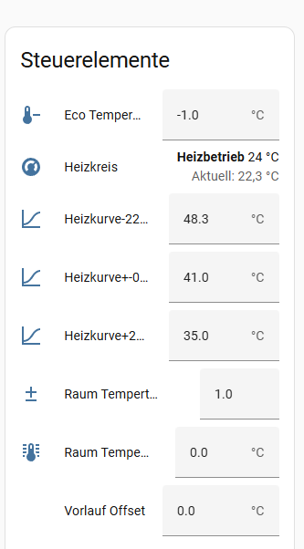

# Heizkurve

*Zuletzt geändert am 06.09.2026*

**Stand:** Release 3.5.2 (Rewrite auf [`modbus-connection`](https://github.com/home-assistant-libs/modbus-connection)/`tmodbus`, Branch `3.5`; Hintergrund zum Rewrite: [Issue #99](https://github.com/GuidoJeuken-6512/lambda_heat_pumps/issues/99))

Die Lambda Heat Pumps Integration unterstützt die Konfiguration von Heizkurven für jeden Heizkreis. Die Heizkurve bestimmt die Vorlauftemperatur basierend auf der Außentemperatur und ermöglicht eine energieeffiziente und komfortable Heizungssteuerung.

## Übersicht

Die Heizkurven-Funktion verwendet drei Stützpunkte, um die Vorlauftemperatur in Abhängigkeit von der Außentemperatur zu berechnen. Die Integration interpoliert linear zwischen diesen Stützpunkten und berücksichtigt zusätzliche Einflussfaktoren wie Flow-Line-Offset, Raumthermostat-Anpassung und ECO-Modus.



## Funktionsweise

Die Heizkurven-Berechnung erfolgt in mehreren Schritten:

1. **Lineare Interpolation**: Basierend auf der aktuellen Außentemperatur wird zwischen den drei Stützpunkten interpoliert
2. **Raumthermostat-Anpassung**: Bei aktiviertem Raumthermostat wird die Vorlauftemperatur basierend auf der Raumtemperatur angepasst
3. **Flow-Line-Offset**: Ein manueller Offset wird addiert
4. **ECO-Modus**: Im ECO-Modus wird eine Temperaturreduktion angewendet

## Heizkurven-Stützpunkte

Für jeden Heizkreis stehen drei Number-Entities zur Verfügung, die die Heizkurven-Stützpunkte definieren (`CURVE_POINTS` in `const.py`):

### Kaltpunkt (-22°C)

- **Entity-ID**: `number.*_hc1_heating_curve_cold_outside_temp_number`
- **Bereich**: 15.0 bis 75.0 °C
- **Schrittweite**: 0.1 °C
- **Standardwert**: 48.3 °C
- **Beschreibung**: Vorlauftemperatur bei einer Außentemperatur von -22°C

### Mittelpunkt (0°C)

- **Entity-ID**: `number.*_hc1_heating_curve_mid_outside_temp_number`
- **Bereich**: 15.0 bis 75.0 °C
- **Schrittweite**: 0.1 °C
- **Standardwert**: 39.0 °C
- **Beschreibung**: Vorlauftemperatur bei einer Außentemperatur von 0°C

### Warmpunkt (+22°C)

- **Entity-ID**: `number.*_hc1_heating_curve_warm_outside_temp_number`
- **Bereich**: 15.0 bis 75.0 °C
- **Schrittweite**: 0.1 °C
- **Standardwert**: 32.0 °C
- **Beschreibung**: Vorlauftemperatur bei einer Außentemperatur von +22°C

**Hinweis**: Der `*` steht für deinen Geräte-/Namenspräfix (z. B. `eu08l`); das `_number`-Suffix kommt daher, dass diese Werte technisch von `LambdaSettingNumber`-Entities gehalten werden (`number.py`), die sich intern von der gleichnamigen Sensor-/Register-Bezeichnung abgrenzen.

## Berechnung der Vorlauftemperatur

`LambdaHeatingCurveSensor.native_value` (`sensor.py`) berechnet die Vorlauftemperatur automatisch:

### 1. Grundwert aus Heizkurve

Zuerst wird der Grundwert durch lineare Interpolation zwischen den Stützpunkten berechnet (`_read_curve()` in `sensor.py`):

- **Außentemperatur ≥ +22°C**: Verwendet den Warmpunkt-Wert
- **Außentemperatur zwischen 0°C und +22°C**: Interpoliert zwischen Mittelpunkt und Warmpunkt
- **Außentemperatur zwischen -22°C und 0°C**: Interpoliert zwischen Kaltpunkt und Mittelpunkt
- **Außentemperatur ≤ -22°C**: Verwendet den Kaltpunkt-Wert

**Beispiel**: Bei einer Außentemperatur von 10.7°C und den Standardwerten:
- Mittelpunkt (0°C): 39.0°C
- Warmpunkt (+22°C): 32.0°C
- **Interpolierter Wert**: ≈ 35.6°C

### 2. Raumthermostat-Anpassung

Wenn die Raumthermostat-Steuerung aktiviert ist (Options-Flow), wird die Vorlauftemperatur basierend auf der Differenz zwischen Soll- und Ist-Raumtemperatur angepasst (`_room_correction()`):

```
Anpassung = (Soll-Temperatur - Ist-Temperatur - Offset) × Faktor
```

Weitere Informationen: [Raumthermostat](https://guidojeuken-6512.github.io/lambda_heat_pumps/Anwender/raumthermometer/)

### 3. Flow-Line-Offset

Ein manueller Offset kann über die Number-Entity `number.*_hc1_flow_line_offset_temperature_number` hinzugefügt werden. Anders als die Heizkurven-Stützpunkte ist dieser Wert ein echtes, vom Controller gehaltenes **Register** (`LambdaFlowLineOffsetNumber` schreibt und liest `set_flow_line_offset_temperature`), kein rein integrationsinterner Wert:

- **Bereich**: -10.0 bis +10.0 °C
- **Standardwert**: 0.0 °C (Controller-Default)
- **Verwendung**: Für manuelle Anpassungen der Vorlauftemperatur

### 4. ECO-Modus

Wenn der Heizkreis im ECO-Modus (`operating_state == HeatingCircuitOperatingState.ECO`) ist, wird eine Temperaturreduktion angewendet:

- **Entity-ID**: `number.*_hc1_eco_temp_reduction_number`
- **Bereich**: -10.0 bis 0.0 °C
- **Standardwert**: -1.0 °C
- **Beschreibung**: Temperaturreduktion im ECO-Modus

Die ECO-Temperaturreduktion wird zur berechneten Vorlauftemperatur addiert (negativer Wert = Reduktion).

## Konfiguration

### Heizkurven-Stützpunkte anpassen

1. **Öffnen Sie Home Assistant:**
   - Gehen Sie zu **Einstellungen** → **Geräte & Dienste**
   - Suchen Sie nach Ihrer Lambda-Integration
   - Klicken Sie auf das Gerät für den gewünschten Heizkreis

2. **Heizkurven-Stützpunkte finden:**
   - Suchen Sie nach den Number-Entities:
     - `Heizkurve-22°C` (Kaltpunkt)
     - `Heizkurve+-0°C` (Mittelpunkt)
     - `Heizkurve+22°C` (Warmpunkt)

3. **Werte anpassen:**
   - Klicken Sie auf die jeweilige Number-Entity
   - Passen Sie den Wert an Ihre Anforderungen an
   - Die Änderung wird sofort übernommen (`LambdaSettingNumber.async_set_native_value()` schreibt direkt in `coordinator.settings` und stößt `coordinator.async_update_listeners()` an — der Heizkurven-Sensor liest also ohne Verzögerung den neuen Wert)

## Berechneter Sensor

Die Integration erstellt automatisch einen Sensor, der die berechnete Vorlauftemperatur anzeigt:

- **Klasse**: `LambdaHeatingCurveSensor` (`sensor.py`)
- **Entity-ID**: `sensor.*_hc1_heating_curve_flow_line_temperature_calc`
- **Name**: "Heizkurve Vorlauf ber."
- **Einheit**: °C
- **Aktualisierung**: Bei jedem Coordinator-Update (Außentemperatur ändert sich) und sofort bei jeder Änderung einer der Heizkurven-Einstellungen

Dieser Sensor zeigt die final berechnete Vorlauftemperatur nach allen Anpassungen (Heizkurve, Raumthermostat, Flow-Line-Offset, ECO-Modus).

### Aus welchen Werten wird die Entity berechnet?

| Schritt | Quelle | Beschreibung |
|--------|--------|--------------|
| **1. Außentemperatur** | `coordinator.device.ambient.temperature_calculated` | Aktuelle Außentemperatur (X für die Heizkurve). |
| **2. Stützpunkte (Y)** | `coordinator.settings[(index, "heating_curve_cold_outside_temp")]` u.a. | Von den drei `LambdaSettingNumber`-Entities veröffentlichte Werte. |
| **3. Stützpunkte (X)** | fest, `CURVE_POINTS` in `const.py` | Kalt = -22 °C, Mitte = 0 °C, Warm = +22 °C. |
| **4. Grundwert** | `_read_curve()` | Lineare Interpolation zwischen den Stützpunkten. Bei Außentemperatur ≥ +22 °C wird der Warmpunkt-Wert verwendet, bei ≤ -22 °C der Kaltpunkt-Wert. |
| **5. Raumthermostat** (wenn aktiviert) | `coordinator.settings[(index, "room_thermostat_offset"/"room_thermostat_factor")]`, `circuit.room_device_temperature`, `circuit.target_room_temperature` | **Anpassung** = (Soll − Ist − Offset) × Faktor, wird addiert. |
| **6. Flow-Line-Offset** | `circuit.set_flow_line_offset_temperature` (Register) | Wird addiert. |
| **7. ECO-Modus** (wenn `operating_state == ECO`) | `coordinator.settings[(index, "eco_temp_reduction")]` | Temperaturreduktion (Default -1 °C), wird addiert. |
| **8. Endergebnis** | — | Auf 1 Dezimalstelle gerundet. |

*Hinweis:* `*` steht für deinen Geräte-/Namenspräfix (z. B. `eu08l`), `hc1` für Heizkreis 1 (bei mehreren Heizkreisen `hc2` usw.).

## Template-Sensor ohne Lambda-Integration (Standalone)

Wenn Sie Home Assistant nutzen, aber **nicht** diese Lambda-Integration (z. B. andere Wärmepumpe oder manuelle Heizungssteuerung), können Sie die gleiche Heizkurven-Berechnung mit einem **Template-Sensor** nachbilden. Der Sensor berechnet die Vorlauftemperatur aus der Außentemperatur und drei Stützpunkten (lineare Interpolation wie oben).

### Voraussetzungen

- Ein **Sensor für die Außentemperatur** (z. B. `sensor.outside_temperature` oder `sensor.weather_temperature`).
- Drei Werte für die Heizkurven-Stützpunkte:
  - **Kaltpunkt (-22 °C):** Vorlauftemperatur bei -22 °C Außentemperatur (z. B. 50 °C).
  - **Mittelpunkt (0 °C):** Vorlauftemperatur bei 0 °C (z. B. 41 °C).
  - **Warmpunkt (+22 °C):** Vorlauftemperatur bei +22 °C (z. B. 35 °C).

Diese Werte können fest im Template stehen oder aus **Input-Number**-Helfern kommen (dann sind sie im UI änderbar).

### Variante A: Feste Stützpunkte im Template

In **Einstellungen** → **Geräte & Dienste** → **Helfer** → **Template-Sensor** einen neuen Sensor anlegen, oder in `configuration.yaml` unter `template:` einbinden:

```yaml
# configuration.yaml (Ausschnitt)
template:
  - sensor:
      - name: "Heizkurve Vorlauf berechnet"
        unique_id: heating_curve_flow_standalone
        unit_of_measurement: "°C"
        state: >
          
          
          
          
          
          
          
          
            {{ y_warm | round(1) }}
          
            {{ (y_mid + (t - x_mid) * (y_warm - y_mid) / (x_warm - x_mid)) | round(1) }}
          
            {{ (y_cold + (t - x_cold) * (y_mid - y_cold) / (x_mid - x_cold)) | round(1) }}
          
            {{ y_cold | round(1) }}
          
```

- **`sensor.outside_temperature`** durch Ihre Außentemperatur-Entity ersetzen.
- **`y_cold`, `y_mid`, `y_warm`** (50, 41, 35) nach Bedarf anpassen.

### Variante B: Stützpunkte aus Input-Number-Helfern

Zuerst drei **Helfer** → **Zahl** anlegen (z. B. `input_number.heating_curve_cold`, `input_number.heating_curve_mid`, `input_number.heating_curve_warm`) mit Min/Max z. B. 15–75 °C und gewünschten Standardwerten. Dann den Template-Sensor so definieren, dass er diese Entities liest:

```yaml
template:
  - sensor:
      - name: "Heizkurve Vorlauf berechnet"
        unique_id: heating_curve_flow_standalone
        unit_of_measurement: "°C"
        state: >
          
          
          
          
          
          
          
          
            {{ y_warm | round(1) }}
          
            {{ (y_mid + (t - x_mid) * (y_warm - y_mid) / (x_warm - x_mid)) | round(1) }}
          
            {{ (y_cold + (t - x_cold) * (y_mid - y_cold) / (x_mid - x_cold)) | round(1) }}
          
            {{ y_cold | round(1) }}
          
```

- **`sensor.outside_temperature`** durch Ihre Außentemperatur-Entity ersetzen.
- **`input_number.heating_curve_*`** durch Ihre Helfer-IDs ersetzen; die `float(50)` usw. sind Fallbacks, wenn die Entity noch keinen Wert hat.

### Formel (Kurz)

- **Außentemperatur ≥ +22 °C:** Ausgabe = Warmpunkt.
- **Zwischen 0 °C und +22 °C:** Lineare Interpolation zwischen Mittelpunkt und Warmpunkt:
  *Vorlauf = y_mid + (t − 0) × (y_warm − y_mid) / 22*
- **Zwischen -22 °C und 0 °C:** Lineare Interpolation zwischen Kaltpunkt und Mittelpunkt:
  *Vorlauf = y_cold + (t − (−22)) × (y_mid − y_cold) / 22*
- **Außentemperatur ≤ -22 °C:** Ausgabe = Kaltpunkt.

Optional können Sie einen **Flow-Line-Offset** (z. B. aus einem weiteren `input_number`) addieren, indem Sie im Template zum Endergebnis `+ states('input_number.flow_offset') | float(0)` hinzufügen.

## Feineinstellung

### Flow-Line-Offset verwenden

Der Flow-Line-Offset eignet sich für:
- **Temporäre Anpassungen**: Kurzfristige Erhöhung oder Reduzierung der Vorlauftemperatur
- **Feineinstellung**: Kleine Korrekturen ohne Änderung der Heizkurven-Stützpunkte
- **Saisonale Anpassungen**: Anpassung für Übergangszeiten

**Beispiel**: Wenn die Heizung etwas zu kalt ist, können Sie einen Flow-Line-Offset von +2.0°C setzen, ohne die gesamte Heizkurve zu ändern.

### ECO-Modus nutzen

Der ECO-Modus reduziert die Vorlauftemperatur, um Energie zu sparen:

- **Aktivierung**: Automatisch, wenn der Heizkreis im ECO-Betriebszustand ist
- **Konfiguration**: Über die Number-Entity `eco_temp_reduction`
- **Empfehlung**: -1.0°C bis -3.0°C für moderate Energieeinsparung

**Hinweis**: Eine zu starke Reduktion kann den Komfort beeinträchtigen.

## Weitere Informationen

- [Raumthermostat](../Anwender/raumthermometer.md) - Integration externer Raumthermostat-Sensoren
- [Ablaufdiagramm](Ablaufdiagramm.md) - Gesamter Setup- und Poll-Ablauf
- [Features](features.md#heizkurve) - Codebeispiele zur Heizkurven-Berechnung
