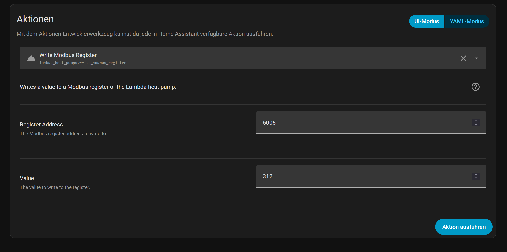

# Vorlauftemperatur per Automatisierung ändern

*Zuletzt geändert am 27.06.2026*



⚠️ **Wichtig**: Das direkte Schreiben von Modbus-Registern kann die Funktion der Wärmepumpe beeinträchtigen. Schreiben Sie nur Register, deren Bedeutung Sie kennen, und testen Sie Änderungen vorsichtig.


Über **Entwicklertools → Aktionen** (Dev Tools → Actions) stellt die Integration die Aktion `lambda_heat_pumps.write_modbus_register` zur Verfügung. Damit lässt sich ein beliebiger Wert auf **jedes** Modbus-Register der Lambda Wärmepumpe schreiben.

Über die Aktion kann das Register 5005 sensor.eu08l_hc1_set_flow_line_temperature beschrieben werden. Hierdurch kann im Kühlbetrieb z.B. die VorlaufSollTemperatur je nach berechnetem Taupunkt angepasst werden. Bei einem anderen Heizkreis muss die Registeradesse dementsprechend angepasst werden 5105 für HC2......


Wie diese Aktionen in einer Home Assistant Automation eingesetzt werden kann, ist hier zu lesen:  [Aktionen (read / write Modbus register)](../Anwender/aktionen-modbus.md)

## Beispiel: Taupunkt-Schutz für den Vorlauf im Kühlbetrieb

Die folgende Automatisierung prüft zuerst live über die Aktion `lambda_heat_pumps.read_modbus_register`, ob der Heizkreis im Kühlbetrieb läuft (Register 5n01, z. B. 5001 für HC1) — sonst bricht sie sofort ab. Andernfalls liest sie den Vorlauf-Istwert (Register 5n02, z. B. 5002 für HC1), berechnet den Taupunkt aus Raumtemperatur und Luftfeuchtigkeit (Magnus-Formel) und hebt bei Bedarf die Vorlauf-Solltemperatur (Register 5n05, z. B. 5005 für HC1) automatisch an, sobald der Vorlauf den Taupunkt erreicht bzw. unterschreitet (Kondensations-/Schwitzwassergefahr an Leitungen oder Flächenkühlung).

> **Hinweis zum Einfügen**: Der Block unten ist **eine einzelne** Automatisierung (kein `automation:`-Wrapper). So lässt er sich direkt im UI-YAML-Editor einer Automatisierung einfügen. Bei Einfügen in `automations.yaml` muss vor `alias:` ein Listenstrich (`- `) ergänzt werden, da diese Datei eine Liste von Automatisierungen ist (kein `automation:`-Schlüssel) – siehe [Beispiel unten](#einfügen-in-automationsyaml).

```yaml
alias: "Lambda Kühlbetrieb – Taupunkt-Schutz Vorlauf"
description: >
  Berechnet den Taupunkt aus Raumtemperatur und Luftfeuchtigkeit (Magnus-Formel)
  und hebt im Kühlbetrieb die Vorlauf-Solltemperatur (Register 5005 + Heizkreis-Offset)
  automatisch an, sobald der Vorlauf den Taupunkt erreicht bzw. unterschreitet
  (Kondensations-/Schwitzwassergefahr an Leitungen/Flächenkühlung).
variables:
  # ─── Hier anpassen ───────────────────────────────────────────────
  raumtemperatur_sensor: sensor.wohnzimmer_wohnzimmer_temperature          # Sensor für Raumtemperatur (Taupunktberechnung)
  luftfeuchte_sensor: sensor.wohnzimmer_humidity       # Sensor für rel. Luftfeuchtigkeit (Taupunktberechnung)
  heizkreis_index: 1                                           # 1 = HC1, 2 = HC2, 3 = HC3, ... (bestimmt alle Register-Adressen unten)
  sicherheitsabstand: 1.0                                      # °C Mindestabstand, der zum Taupunkt eingehalten werden soll
  # Register-Adressen werden aus heizkreis_index berechnet: 5n01 (Betriebsart lesen), 5n02 (Vorlauf-Istwert lesen), 5n05 (Sollwert schreiben)
  register_adresse_betriebsart: "{{ 5000 + (heizkreis_index - 1) * 100 + 1 }}" # z.B. 5001 für HC1, 5101 für HC2
  register_adresse_vorlauf: "{{ 5000 + (heizkreis_index - 1) * 100 + 2 }}"    # z.B. 5002 für HC1, 5102 für HC2
  register_adresse_sollwert: "{{ 5000 + (heizkreis_index - 1) * 100 + 5 }}"   # z.B. 5005 für HC1, 5105 für HC2
  # ──────────────────────────────────────────────────────────────────
triggers:
  - trigger: state
    entity_id:
      - sensor.wohnzimmer_wohnzimmer_temperature
      - sensor.wohnzimmer_humidity
  - trigger: time_pattern
    minutes: "/5"
conditions:
  - condition: template
    value_template: >
      {{ states(raumtemperatur_sensor) not in ['unknown','unavailable', none]
         and states(luftfeuchte_sensor) not in ['unknown','unavailable', none] }}
actions:
  # Betriebsart live per Modbus-Aktion lesen (Register 5n01) – bricht sofort ab, wenn nicht im Kühlbetrieb
  - action: lambda_heat_pumps.read_modbus_register
    data:
      register_address: "{{ register_adresse_betriebsart | int }}"
    response_variable: betriebsart_register_antwort
  - if:
      - condition: template
        value_template: "{{ 'error' in betriebsart_register_antwort }}"
    then:
      - stop: "Betriebsart-Register konnte nicht gelesen werden"
  - if:
      - condition: template
        value_template: "{{ betriebsart_register_antwort.value != 2 }}"   # 2 = COOLING (HC_OPERATING_STATE-Mapping)
    then:
      - stop: "Heizkreis nicht im Kühlbetrieb (Betriebsart ≠ COOLING) – kein Eingriff nötig"
  # Vorlauf-Istwert live per Modbus-Aktion lesen (Register 5n02), statt eine feste Sensor-Entity zu verwenden
  - action: lambda_heat_pumps.read_modbus_register
    data:
      register_address: "{{ register_adresse_vorlauf | int }}"
    response_variable: vorlauf_register_antwort
  - if:
      - condition: template
        value_template: "{{ 'error' in vorlauf_register_antwort }}"
    then:
      - stop: "Vorlauf-Register konnte nicht gelesen werden"
  - variables:
      vorlauf_ist: "{{ (vorlauf_register_antwort.value | float) / 10 }}"      # Skalierung 0,1°C je Register-Schritt
      t: "{{ states(raumtemperatur_sensor) | float }}"
      rh: "{{ states(luftfeuchte_sensor) | float }}"
      a: 17.62
      b: 243.12
      gamma: "{{ ((17.62 * (states(raumtemperatur_sensor) | float)) / (243.12 + (states(raumtemperatur_sensor) | float))) + (((states(luftfeuchte_sensor) | float) / 100) | log) }}"
  - variables:
      taupunkt: "{{ ((b * gamma) / (a - gamma)) | round(1) }}"
  - if:
      - condition: template
        value_template: "{{ vorlauf_ist <= (taupunkt + sicherheitsabstand) }}"
    then:
      - action: lambda_heat_pumps.write_modbus_register
        data:
          register_address: "{{ register_adresse_sollwert | int }}"
          value: "{{ ((taupunkt + sicherheitsabstand) * 10) | round(0) | int }}"
      - action: system_log.write
        data:
          message: >
            Taupunkt-Schutz aktiv: Vorlauf {{ vorlauf_ist }}°C ≤ Taupunkt {{ taupunkt }}°C
            + Sicherheitsabstand {{ sicherheitsabstand }}°C → Register {{ register_adresse_sollwert }}
            auf {{ taupunkt + sicherheitsabstand }}°C angehoben.
          level: warning
mode: single
```

### Funktion testen (ohne Eingriff) im Template-Editor

Bevor die Automatisierung aktiviert wird, lässt sich die Taupunkt-Berechnung gefahrlos in **Entwicklertools → Vorlage** (Dev Tools → Template) testen. Das Template liest nur Sensorwerte, schreibt **nichts** an die Wärmepumpe, und aktualisiert sich live bei Sensoränderungen.

> **Hinweis**: Der Template-Editor kann keine Aktionen (Services) aufrufen — der dynamische Live-Read über `lambda_heat_pumps.read_modbus_register` (Betriebsart **und** Vorlauf) aus der Automatisierung lässt sich hier daher nicht nachbilden. Zum Testen der reinen Taupunkt-Formel wird der Vorlauf-Istwert stattdessen über die vorhandene Sensor-Entity `vorlauf_sensor` gelesen (z. B. `sensor.eu08l_hc1_flow_line_temperature` — entspricht Register 5n02); die Betriebsart-Prüfung wird hier ausgelassen.

```jinja2


















Heizkreis: HC{{ heizkreis_index }}  (Betriebsart-Register {{ register_adresse_betriebsart }}, Vorlauf-Register {{ register_adresse_vorlauf }}, Sollwert-Register {{ register_adresse_sollwert }})
Raumtemperatur: {{ t }} °C
Luftfeuchtigkeit: {{ rh }} %
Vorlauf (Ist, aus {{ vorlauf_sensor }} ≙ Register {{ register_adresse_vorlauf }}): {{ vorlauf_ist }} °C

Taupunkt: {{ taupunkt }} °C

Anpassung Vorlauf auf: {{ neuer_vorlauf }} °C (Register {{ register_adresse_sollwert }} = {{ register_wert }})

Kein Eingriff nötig (Abstand zum Taupunkt: {{ (vorlauf_ist - taupunkt) | round(1) }} °C)

```

**Live-Read separat testen**: Um zu prüfen, dass Register `register_adresse_vorlauf` (5n02) tatsächlich den erwarteten Vorlaufwert liefert, die Aktion `lambda_heat_pumps.read_modbus_register` einmalig über **Entwicklertools → Aktionen** mit `register_address: 5002` (bzw. dem berechneten Wert für den eigenen Heizkreis) ausführen und die Antwort (`value`, roher Registerwert ×10) mit dem Sensor-Wert oben vergleichen.

**Beispiel-Ausgabe** (Raumtemperatur 24 °C, Luftfeuchtigkeit 65 %, Vorlauf 17,5 °C):

```
Heizkreis: HC1  (Betriebsart-Register 5001, Vorlauf-Register 5002, Sollwert-Register 5005)
Raumtemperatur: 24.0 °C
Luftfeuchtigkeit: 65.0 %
Vorlauf (Ist, aus sensor.eu08l_hc1_flow_line_temperature ≙ Register 5002): 17.5 °C

Taupunkt: 17.0 °C

Anpassung Vorlauf auf: 18.0 °C (Register 5005 = 180)
```

Liegt der Vorlauf-Istwert deutlich über `Taupunkt + Sicherheitsabstand`, erscheint stattdessen der „Kein Eingriff"-Zweig, z. B. bei gleicher Raumtemperatur/Luftfeuchtigkeit, aber Vorlauf 20,0 °C:

```
Heizkreis: HC1  (Betriebsart-Register 5001, Vorlauf-Register 5002, Sollwert-Register 5005)
Raumtemperatur: 24.0 °C
Luftfeuchtigkeit: 65.0 %
Vorlauf (Ist, aus sensor.eu08l_hc1_flow_line_temperature ≙ Register 5002): 20.0 °C

Taupunkt: 17.0 °C

Kein Eingriff nötig (Abstand zum Taupunkt: 3.0 °C)
```

Erst wenn die berechneten Werte in beiden Fällen plausibel sind, sollte das identische Variablen-Set in der Automatisierung oben verwendet werden.

### Einfügen in `automations.yaml`

Wird die Automatisierung direkt in der `automations.yaml` ergänzt (statt über die UI), muss der Block als **Listeneintrag** (führendes `- ` vor `alias:`, restliche Zeilen um zwei Leerzeichen eingerückt) angefügt werden, z. B.:

```yaml
- alias: "Lambda Kühlbetrieb – Taupunkt-Schutz Vorlauf"
  description: >
    ...
  variables:
    ...
  triggers:
    ...
  conditions:
    ...
  actions:
    ...
  mode: single
```

**Anpassen vor Verwendung:**

- `raumtemperatur_sensor`, `luftfeuchte_sensor` auf die eigenen Entity-IDs setzen
- `heizkreis_index` falls nicht HC1 — steuert automatisch **alle drei** Register-Adressen (Betriebsart lesen, Vorlauf lesen, Sollwert schreiben)
- `sicherheitsabstand` nach Bedarf (1,0 °C ist ein konservativer Default)

**Funktionsweise:**

1. **Betriebsart-Prüfung**: Register `register_adresse_betriebsart` (5n01, dynamisch aus `heizkreis_index` berechnet) wird live per `lambda_heat_pumps.read_modbus_register` gelesen. Ist der rohe Registerwert ≠ `2` (= `COOLING` im `HC_OPERATING_STATE`-Mapping der Integration), bricht die Automatisierung per `stop:` sofort ab, bevor irgendetwas berechnet oder geschrieben wird.
2. **Vorlauf-Istwert**: wird anschließend ebenso live aus Register `register_adresse_vorlauf` (5n02) gelesen, über `response_variable: vorlauf_register_antwort` ausgewertet und mit `/10` skaliert (0,1°C-Auflösung). Schlägt einer der beiden Lesevorgänge fehl (`error` in der Antwort), bricht die Automatisierung ebenfalls per `stop:` ab.
3. **Taupunkt** wird per Magnus-Formel aus Raumtemperatur (`t`) und relativer Luftfeuchte (`rh`) berechnet: γ = (a·t)/(b+t) + ln(rh/100), Taupunkt = (b·γ)/(a−γ)
4. **Trigger**: bei jeder Änderung der Raumtemperatur- bzw. Luftfeuchte-Sensoren sowie alle 5 Minuten als Sicherheitsnetz (Betriebsart und Vorlauf werden ja ohnehin bei jedem Lauf live gelesen, daher kein State-Trigger dafür nötig)
5. **Register-Adressen**: `register_adresse_betriebsart` (5n01), `register_adresse_vorlauf` (5n02) und `register_adresse_sollwert` (5n05) werden alle dynamisch aus `heizkreis_index` berechnet (z. B. 5001/5002/5005 für HC1, 5101/5102/5105 für HC2, …)
6. Wenn der Vorlauf den Taupunkt + Sicherheitsabstand **erreicht oder unterschreitet**, wird die Vorlauf-Solltemperatur per `lambda_heat_pumps.write_modbus_register` direkt auf `Taupunkt + Sicherheitsabstand` gesetzt (Wert ×10 wegen der 0,1°C-Skalierung des Registers)

**Mögliche Werte von `operating_state`** (HC_OPERATING_STATE-Mapping der Integration, roher Registerwert → Text): `0=HEATING`, `1=ECO`, `2=COOLING`, `3=FLOORDRY`, `4=FROST`, `5=MAX-TEMP`, `6=ERROR`, `7=SERVICE`, `8=HOLIDAY`, `9=CH-SUMMER`, `10=CC-WINTER`, `11=PRIO-STOP`, `12=OFF`, `13=RELEASE-OFF`, `14=TIME-OFF`, `15=STBY`, `16=STBY-HEATING`, `17=STBY-ECO`, `18=STBY-COOLING`, `19=STBY-FROST`, `20=STBY-FLOORDRY`. Nur bei aktivem `COOLING` (Wert `2`) greift der Taupunkt-Schutz; `STBY-COOLING` (Wert `18`, Kühlbetrieb aktiviert, aber gerade keine Anforderung) führt **nicht** zum Eingreifen.