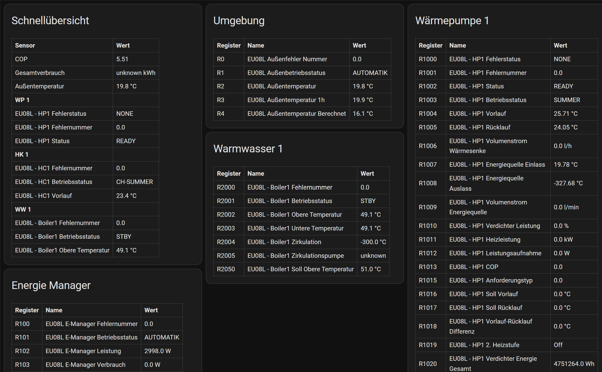

 
# Lambda Dynamisch Dashboard (Vorlage)

*Zuletzt geändert am 02.05.2026*

Diese Vorlage beschreibt ein **dynamisches** Lovelace-Dashboard für die Lambda Wärmepumpen Integration.

**Besonderheit:** Der Gerätename (Prefix wie `eu08l`) wird automatisch aus der Integration ausgelesen – es muss **nichts angepasst** werden. Das Dashboard passt sich jeder Lambda-Konfiguration ohne manuelle Änderung an. Das Dashboard zeigt zudem das jeweilige Modbus Register zum Sensor an.

<a href="../assets/dashboard_lambda_dynamisch1.png" target="_blank" rel="noopener noreferrer" title="Bild groß öffnen"></a>

## Funktionsweise

Jede Card ermittelt zur Laufzeit den Prefix des konfigurierten Geräts über `integration_entities()` und zeigt alle zugehörigen Sensoren nach **Register-Nummer sortiert** als Tabelle. Cards für nicht konfigurierte Geräte zeigen *Keine Sensoren.*

## Einbindung in Home Assistant

1. **Einstellungen** → **Dashboards** → **„+ Dashboard hinzufügen"**
   - Name: `Lambda Dynamisch`, URL: `lambda-dyn`
2. Dashboard öffnen → oben rechts **Bleistift** → **„In YAML bearbeiten"**
3. Den unten stehenden YAML-Code einfügen und speichern.

## YAML (Copy & Paste)

Das Dashboard enthält je **ein Beispiel pro Gerätetyp**. Weitere Geräte (z. B. Heizkreis 2) durch Kopieren einer Card und Anpassen von `title` und Sub-Prefix hinzufügen – siehe [Card erweitern](#card-erweitern).

```yaml
title: Lambda WP
views:
  - title: Lambda WP
    path: default_view
    cards:

      - type: markdown
        title: Schnellübersicht
        content: |
          
          
          | Sensor | Wert |
          |--------|------|
          | COP | {{ states('sensor.' + dp + '_cop') }} |
          | Gesamtverbrauch | {{ states('sensor.' + dp + '_total_power_consumption_lambda') }} kWh |
          | Außentemperatur | {{ states('sensor.' + dp + '_ambient_temperature') }} °C |
          
          
          
          | **{{ label }}** | |
          
          | {{ state_attr(e, 'friendly_name') or e }} | {{ states(e) }} {{ state_attr(e, 'unit_of_measurement') or '' }} |
          
          
          

      - type: markdown
        title: Umgebung
        content: |
          
          
          
          
          
          _Keine Sensoren._
          
          | Register | Name | Wert |
          |----------|------|------|
          
          | R{{ state_attr(e, 'register') }} | {{ state_attr(e, 'friendly_name') or '—' }} | {{ states(e) }} {{ state_attr(e, 'unit_of_measurement') or '' }} |
          
          

      - type: markdown
        title: Energie Manager
        content: |
          
          
          
          
          
          _Keine Sensoren._
          
          | Register | Name | Wert |
          |----------|------|------|
          
          | R{{ state_attr(e, 'register') }} | {{ state_attr(e, 'friendly_name') or '—' }} | {{ states(e) }} {{ state_attr(e, 'unit_of_measurement') or '' }} |
          
          

      - type: markdown
        title: Wärmepumpe 1
        content: |
          
          
          
          
          
          _Keine Sensoren._
          
          | Register | Name | Wert |
          |----------|------|------|
          
          | R{{ state_attr(e, 'register') }} | {{ state_attr(e, 'friendly_name') or '—' }} | {{ states(e) }} {{ state_attr(e, 'unit_of_measurement') or '' }} |
          
          

      - type: markdown
        title: Warmwasser 1
        content: |
          
          
          
          
          
          _Keine Sensoren._
          
          | Register | Name | Wert |
          |----------|------|------|
          
          | R{{ state_attr(e, 'register') }} | {{ state_attr(e, 'friendly_name') or '—' }} | {{ states(e) }} {{ state_attr(e, 'unit_of_measurement') or '' }} |
          
          

      - type: markdown
        title: Heizkreis 1
        content: |
          
          
          
          
          
          _Keine Sensoren._
          
          | Register | Name | Wert |
          |----------|------|------|
          
          | R{{ state_attr(e, 'register') }} | {{ state_attr(e, 'friendly_name') or '—' }} | {{ states(e) }} {{ state_attr(e, 'unit_of_measurement') or '' }} |
          
          
```

## Card erweitern

Eine Card kopieren und `title` sowie den Sub-Prefix (`dp + '_...'`) anpassen:

| Gerät           | `title`           | Sub-Prefix        |
|-----------------|-------------------|-------------------|
| Umgebung        | `Umgebung`        | `_ambient`        |
| Energie Manager | `Energie Manager` | `_emgr`           |
| Wärmepumpe 1    | `Wärmepumpe 1`    | `_hp1`            |
| Wärmepumpe 2    | `Wärmepumpe 2`    | `_hp2`            |
| Warmwasser 1    | `Warmwasser 1`    | `_boil1`          |
| Warmwasser 2    | `Warmwasser 2`    | `_boil2`          |
| Heizkreis 1     | `Heizkreis 1`     | `_hc1`            |
| Heizkreis 2     | `Heizkreis 2`     | `_hc2`            |
| Heizkreis 3     | `Heizkreis 3`     | `_hc3`            |
| Heizkreis 4     | `Heizkreis 4`     | `_hc4`            |

## Template-Erklärung

**Prefix-Erkennung** – die ersten zwei Zeilen jeder Card:

```jinja2


```

- `integration_entities('lambda_heat_pumps')` liefert alle Entity-IDs der Integration
- Erste Sensor-Entity: z. B. `sensor.eu08l_ambient_temperature`
- `split('.')[1]` → `eu08l_ambient_temperature`, dann `split('_')[0]` → `eu08l`

**Sensor-Tabelle:**

- `selectattr('attributes.register', 'defined')` — nur Sensoren mit Register-Attribut (Lambda-spezifisch)
- `sort(attribute='attributes.register')` — Reihenfolge nach Modbus-Register-Nummer
