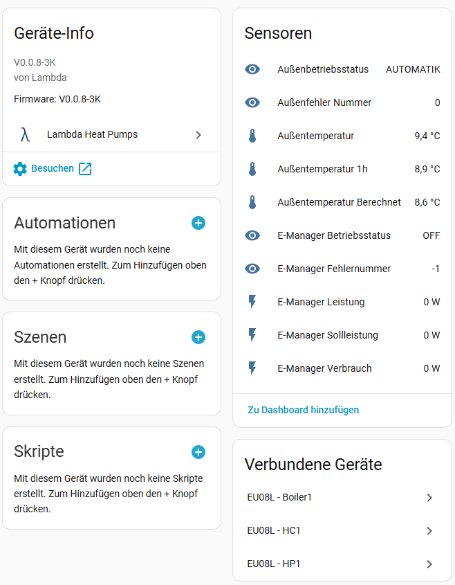
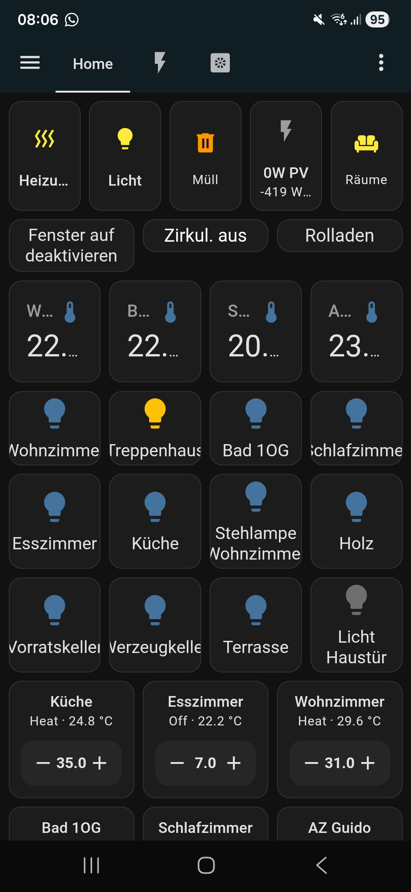

# Lambda Integration für Home Assistant

  

    

  

  

    
Die <strong>Lambda Heat Pumps Integration</strong> ist eine benutzerdefinierte Komponente für Home Assistant, die eine Verbindung zu Lambda Wärmepumpen über das Modbus TCP-Protokoll herstellt. Die Integration bietet automatische Modulerkennung, umfassende Sensoren für Betriebsüberwachung und Energieverbrauch, sowie intelligente Steuerungsfunktionen wie Heizkurven-Konfiguration, PV-Überschuss-Steuerung und Raumthermostat-Integration.

    
    
Über die Integration können die Sensoren der Lambda Wärmepumpe in Home Assistant angezeigt und die Lambda kann über die Integration gesteuert werden.

    
    
Alle Entitäten aus der Integration können auch in Automatisierungen / Szenen usw. verwendet werden.

    
  

Die Integration ist mehrsprachig, im Moment wird Deutsch und Englisch unterstützt.

Detaillierte Informationen zu den einzelnen Features finden Sie in den entsprechenden Unterseiten unter Anwender- bzw. Entwickler-Dokumentation.
### [Anwender Dokumentation](Anwender/features.md)

### [Entwickler Dokumentation](Entwickler/features.md)

## Home Assistant

Home Assistant ist eine Open-Source-Home-Automation-Plattform, die lokale Kontrolle und Datenschutz in den Vordergrund stellt. Es ermöglicht die Integration und Steuerung von über 1000 verschiedenen Smart-Home-Geräten und -Diensten, alles lokal in deinem Netzwerk ohne Cloud-Abhängigkeit.

[Home Assistant Website](https://www.home-assistant.io/){:target="_blank" rel="noopener noreferrer"}
### Mein Home Assistant 
Mehr zu meiner Home Assistant Instanz kann hier nachgelesen werden:
[Meine Home Assistant Website](https://homeassistant.com.de/category/homeassistant/){:target="_blank" rel="noopener noreferrer"}

