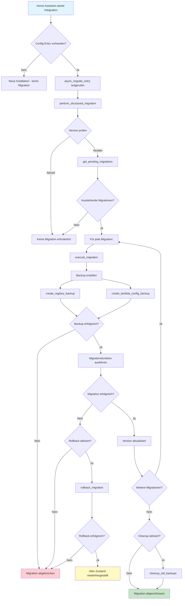

# Lambda Heat Pumps - Migrationssystem

## Übersicht

Das Migrationssystem der Lambda Heat Pumps Integration ermöglicht eine strukturierte und sichere Aktualisierung von Konfigurationen und Entity-Registrierungen bei Versionsupdates. Es unterstützt automatische Backups, Rollback-Mechanismen und sequenzielle Migrationen über mehrere Versionen hinweg.

## Architektur

### Hauptkomponenten

1. **Migration Version Management** (`const_migration.py`)
   - `MigrationVersion` Enum: Definiert alle verfügbaren Migrationsversionen
   - Konstanten für Backup, Cleanup und Rollback-Einstellungen

2. **Migrationsfunktionen** (`migration.py`)
   - Spezifische Migrationsfunktionen für jede Version
   - Backup- und Rollback-System
   - Zentrale Migrationsdispatcher

3. **Entry Point** (`__init__.py`)
   - `async_migrate_entry`: Wird von Home Assistant aufgerufen

## Migrationsversionen

| Version | Name | Beschreibung |
|---------|------|--------------|
| 1 | INITIAL | Ursprüngliche Version |
| 2 | LEGACY_NAMES | Entity-Namen Migration (bereinigt alte/inkonsistente Entities) |
| 3 | CYCLING_OFFSETS | Fügt `cycling_offsets` zu `lambda_wp_config.yaml` hinzu |
| 4 | ENERGY_CONSUMPTION | Fügt `energy_consumption_sensors` und `energy_consumption_offsets` hinzu |
| 5 | ENTITY_OPTIMIZATION | Optimiert Entity-Struktur |
| 6 | CONFIG_RESTRUCTURE | Ändert Konfigurationsschema |
| 7 | UNIFIED_CONFIG_MIGRATION | Template-basierte Migration aller Config-Abschnitte |
| 8 | REGISTER_ORDER_TERMINOLOGY | Terminologie-Korrektur: `int32_byte_order` → `int32_register_order` |

## Ablaufplan



## Detaillierter Ablauf

### 1. Initialisierung

**Funktion**: `async_migrate_entry(hass, config_entry)`

- Wird automatisch von Home Assistant aufgerufen, wenn eine Config Entry geladen wird
- Delegiert an `perform_structured_migration()`

### 2. Versionsprüfung

**Funktion**: `perform_structured_migration(hass, config_entry)`

```python
current_version = config_entry.version
target_version = MigrationVersion.get_latest()
```

**Prüfungen**:
- Ist `current_version >= target_version`? → Keine Migration erforderlich
- Ermittelt alle ausstehenden Migrationen via `get_pending_migrations()`

**Wichtig**: Neue Config Entries erhalten automatisch die aktuelle Version aus `MIGRATION_VERSION` (importiert aus `const_migration.py`), die automatisch aus `MigrationVersion.get_latest().value` abgeleitet wird.

### 3. Backup-Erstellung

**Funktionen**:
- `create_registry_backup()`: Backup der Home Assistant Registry-Dateien
- `create_lambda_config_backup()`: Backup der `lambda_wp_config.yaml`

**Backup-Dateien**:
- `core.entity_registry.{migration_name}_{timestamp}`
- `core.device_registry.{migration_name}_{timestamp}`
- `core.config_entries.{migration_name}_{timestamp}`
- `lambda_wp_config.{migration_name}_{timestamp}.yaml`

**Backup-Verzeichnis**: `{config_dir}/lambda_heat_pumps/backup/`

### 4. Migration ausführen

**Funktion**: `execute_migration(hass, config_entry, target_version)`

**Ablauf**:
1. Migrationsfunktion aus `MIGRATION_FUNCTIONS` Dictionary laden
2. Backup erstellen (Registry + Config)
3. Migrationsfunktion aufrufen
4. Bei Erfolg: **Version im Config Entry sofort aktualisieren** auf `migration_version.value`
5. Bei Erfolg: Logging mit Versionsnummer
6. Bei Fehler: Rollback (falls aktiviert)

**Wichtig**: Die Version wird **sofort nach jeder erfolgreichen Migration** aktualisiert, nicht erst am Ende aller Migrationen. Dies verhindert, dass bei einem Neustart während mehrerer Migrationen alle Migrationen erneut ausgeführt werden müssen.

### 5. Spezifische Migrationsfunktionen

#### Version 2: Legacy Names Migration

**Funktion**: `migrate_to_legacy_names()`

**Aktivität**:
- Bereinigt Entity Registry von alten/inkonsistenten Climate- und Sensor-Entitäten
- Verwendet aktuelle Namenslogik (`generate_sensor_names`) um gültige Entities zu identifizieren
- Entfernt alle Entities, die nicht im aktuellen Schema sind

#### Version 3: Cycling Offsets Migration

**Funktion**: `migrate_to_cycling_offsets()`

**Aktivität**:
- Fügt `cycling_offsets` Sektion zu `lambda_wp_config.yaml` hinzu
- Verwendet `DEFAULT_CYCLING_OFFSETS` als Vorlage

**DEPRECATED**: Wird durch Version 7 (Unified Config Migration) ersetzt

#### Version 4: Energy Consumption Migration

**Funktion**: `migrate_to_energy_consumption()`

**Aktivität**:
- Fügt `energy_consumption_sensors` Sektion hinzu
- Fügt `energy_consumption_offsets` Sektion hinzu
- Verwendet `DEFAULT_ENERGY_CONSUMPTION_SENSORS` und `DEFAULT_ENERGY_CONSUMPTION_OFFSETS`

**DEPRECATED**: Wird durch Version 7 (Unified Config Migration) ersetzt

#### Version 7: Unified Config Migration

**Funktion**: `migrate_to_unified_config()`

**Aktivität**:
- Template-basierte Migration aller Konfigurationsabschnitte
- Verwendet `migrate_lambda_config_sections()` aus `utils.py`
- Fügt fehlende Config-Sektionen basierend auf Template hinzu

#### Version 8: Register Order Terminology Migration

**Funktion**: `migrate_to_register_order_terminology()`

**Aktivität**:
- Ersetzt `modbus.int32_byte_order` durch `modbus.int32_register_order`
- Erstellt Backup vor Änderung
- Aktualisiert YAML-Datei

### 6. Rollback-Mechanismus

**Funktion**: `rollback_migration()`

**Aktivierung**:
- Nur wenn `ROLLBACK_ENABLED = True` (Standard: aktiviert)
- Wird ausgeführt, wenn Migration fehlschlägt
- Bei kritischen Fehlern (`ROLLBACK_ON_CRITICAL_ERRORS = True`)

**Kritischer Fehler-Schwellenwert**: 
- `CRITICAL_ERROR_THRESHOLD = 0.5` (50% der Migrationen müssen fehlschlagen)

**Hinweis**: Die aktuelle Implementierung ist ein Platzhalter - vollständige Rollback-Logik muss noch implementiert werden.

### 7. Cleanup

**Funktion**: `cleanup_old_backups()`

**Aktivierung**:
- Automatisch nach erfolgreicher Migration, wenn `CLEANUP_ON_MIGRATION = True`
- Manuell aufrufbar

**Aktivität**:
- Analysiert Backup-Dateien auf Alter
- Löscht Backups älter als `BACKUP_RETENTION_DAYS`
- Retention je nach Dateityp:
  - Registry-Backups: 30 Tage
  - Config-Backups: 60 Tage
  - Alte .backup Dateien: 7 Tage

## Versionsverwaltung

### Zentrale Versionskonstante

Die aktuelle Migration-Version wird zentral in `const_migration.py` verwaltet:

```python
# Aktuelle Migration-Version (wird automatisch aus MigrationVersion.get_latest() ermittelt)
MIGRATION_VERSION = MigrationVersion.get_latest().value
```

**Vorteile**:
- Zentrale Quelle für die aktuelle Version
- Automatische Aktualisierung bei neuen Migration-Versionen
- Keine manuelle Synchronisation erforderlich

### Config Flow verwendet zentrale Konstante

`config_flow.py` importiert und verwendet die zentrale Konstante:

```python
from .const_migration import MIGRATION_VERSION

class LambdaConfigFlow(ConfigFlow, domain=DOMAIN):
    VERSION = MIGRATION_VERSION  # Wird automatisch aus const_migration.py importiert
```

**Ergebnis**: Neue Config Entries erhalten automatisch die aktuelle Migration-Version (aktuell: 8).

### Versionsaktualisierung nach Migration

Nach jeder erfolgreichen Migration wird die Version im Config Entry sofort aktualisiert:

```python
# In perform_structured_migration() nach erfolgreicher Migration:
if success:
    hass.config_entries.async_update_entry(
        config_entry,
        version=migration_version.value
    )
```

**Vorteile**:
- **Robustheit bei Fehlern**: Wenn eine Migration fehlschlägt, ist die Version bereits auf die letzte erfolgreiche Migration gesetzt
- **Fortschritt erhalten**: Bei Neustart wird nur ab der letzten erfolgreichen Migration fortgesetzt
- **Reihenfolge-Fehler abgefangen**: Jede Migration wird einzeln dokumentiert

## Migrationsfunktionen Dictionary

```python
MIGRATION_FUNCTIONS = {
    MigrationVersion.LEGACY_NAMES: migrate_to_legacy_names,
    MigrationVersion.CYCLING_OFFSETS: migrate_to_cycling_offsets,
    MigrationVersion.ENERGY_CONSUMPTION: migrate_to_energy_consumption,
    MigrationVersion.ENTITY_OPTIMIZATION: migrate_to_entity_optimization,
    MigrationVersion.CONFIG_RESTRUCTURE: migrate_to_config_restructure,
    MigrationVersion.UNIFIED_CONFIG_MIGRATION: migrate_to_unified_config,
    MigrationVersion.REGISTER_ORDER_TERMINOLOGY: migrate_to_register_order_terminology,
}
```

## Konfiguration

### Backup-Einstellungen

```python
MIGRATION_BACKUP_DIR = "lambda_heat_pumps/backup"
BACKUP_RETENTION_DAYS = {
    "entity_registry": 30,
    "device_registry": 30,
    "config_entries": 30,
    "lambda_config": 60,
    "old_backups": 7,
}
```

### Rollback-Einstellungen

```python
ROLLBACK_ENABLED = True
ROLLBACK_ON_CRITICAL_ERRORS = True
CRITICAL_ERROR_THRESHOLD = 0.5
```

### Cleanup-Einstellungen

```python
CLEANUP_ON_MIGRATION = True
CLEANUP_ENABLED = True
CLEANUP_INTERVAL_DAYS = 7
```

## Fehlerbehandlung

### Fehlerhierarchie

1. **Backup-Fehler**: Migration wird abgebrochen, keine Änderungen
2. **Migrationsfehler**: Rollback wird durchgeführt (falls aktiviert)
3. **Kritische Fehler**: Rollback aller Migrationen, wenn Schwellenwert erreicht

### Logging

Alle Migrationen werden ausführlich geloggt:
- Info: Erfolgreiche Migrationen
- Warning: Übersprungene Migrationen
- Error: Fehlgeschlagene Migrationen

**Log-Präfix**: `Migration`

## Beispiel-Ablauf

### Szenario: Upgrade von Version 1 auf Version 8

1. **Home Assistant startet** → `async_migrate_entry()` wird aufgerufen
2. **Versionsprüfung**: `current_version = 1`, `target_version = 8`
3. **Ausstehende Migrationen**: [2, 3, 4, 5, 6, 7, 8]
4. **Für jede Migration**:
   - Backup erstellen (Registry + Config)
   - Migrationsfunktion ausführen
   - Version aktualisieren
5. **Nach allen Migrationen**: Cleanup alter Backups
6. **Ergebnis**: Config Entry ist auf Version 8

### Log-Ausgabe (Beispiel)

```
INFO: Starte strukturierte Migration für Config abc123: Version 1 -> 8
INFO: Ausstehende Migrationen für Config abc123: ['LEGACY_NAMES', 'CYCLING_OFFSETS', ...]
INFO: Starte Migration zu Version LEGACY_NAMES für Config abc123
INFO: Registry backup erstellt: /config/lambda_heat_pumps/backup/core.entity_registry.legacy_names_migration_20240101_120000
INFO: Lambda config backup erstellt: /config/lambda_heat_pumps/backup/lambda_wp_config.legacy_names_migration_20240101_120000.yaml
INFO: Migration zu Version LEGACY_NAMES für Config abc123 erfolgreich
...
INFO: Alle Migrationen für Config abc123 erfolgreich abgeschlossen (7/7)
INFO: Starte Backup-Bereinigung
INFO: Backup-Bereinigung abgeschlossen: 3 Dateien gelöscht
```

## Best Practices

### Für Entwickler

1. **Neue Migration hinzufügen**:
   - Neue Version zu `MigrationVersion` Enum hinzufügen
   - Migrationsfunktion implementieren
   - Funktion zu `MIGRATION_FUNCTIONS` Dictionary hinzufügen
   - Migration-Name zu `MIGRATION_NAMES` hinzufügen

2. **Backup immer erstellen**: Vor jeder Änderung
3. **Idempotenz**: Migrationen sollten mehrfach ausführbar sein
4. **Logging**: Ausführliche Logs für Debugging

### Für Benutzer

1. **Backups prüfen**: Vor wichtigen Updates Backups verifizieren
2. **Logs überwachen**: Bei Problemen Logs prüfen
3. **Manuelle Backups**: Bei kritischen Systemen zusätzliche manuelle Backups erstellen

## Kompatibilität

### Alte Funktionen

- `perform_option_c_migration()`: Veraltet, delegiert an `perform_structured_migration()`
- Wird für Rückwärtskompatibilität beibehalten

### Home Assistant Integration

- `async_migrate_entry()`: Standard Home Assistant Entry Point
- Wird automatisch von Home Assistant aufgerufen

## Troubleshooting

### Problem: Migration schlägt fehl

**Lösung**:
1. Logs prüfen für spezifischen Fehler
2. Backup-Verzeichnis prüfen: `{config_dir}/lambda_heat_pumps/backup/`
3. Manuelles Rollback durchführen (falls erforderlich)

### Problem: Zu viele Backup-Dateien

**Lösung**:
- Cleanup wird automatisch ausgeführt
- Manuell: `cleanup_old_backups()` aufrufen
- Retention-Tage in `const_migration.py` anpassen

### Problem: Migration wird nicht ausgeführt

**Lösung**:
1. Config Entry Version prüfen
2. Prüfen ob Migration bereits ausgeführt wurde
3. Logs prüfen für "Keine Migration erforderlich" Meldung

## Zukünftige Erweiterungen

- Vollständige Rollback-Implementierung
- Migration-Validierung vor Ausführung
- Migration-Tests für jede Version
- Migration-Status-Tracking
- Benutzer-Benachrichtigungen bei Migrationen

